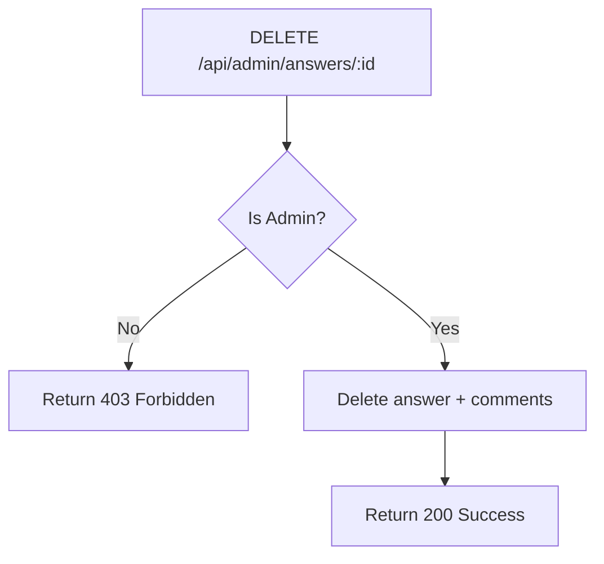

# Task: Admin - Delete Answer

**Endpoint**: `DELETE /api/admin/answers/:answerId`

## 1. API Documentation

- **Method**: `DELETE`
- **URL**: `/api/admin/answers/:answerId`
- **Access**: Private (Admin only)
- **Response (200 OK)**:
  ```json
  {
    "success": true,
    "message": "Answer deleted successfully"
  }
  ```

## 2. Instructions

1. Implement `adminController` in `admin.controller.js`.
2. In `admin.service.js`, write `deleteAnswerService`:
   - Check if requester is admin.
   - Delete answer and all related comments.
   - Return success message.

## 3. Logic Diagram


