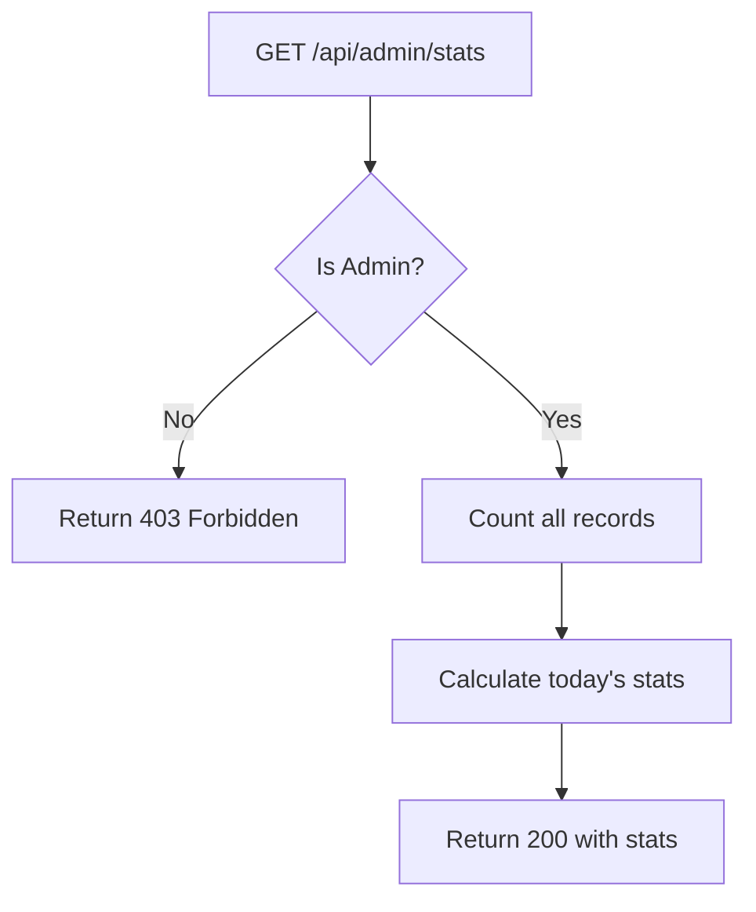

# Task: Admin - Get Dashboard Stats

**Endpoint**: `GET /api/admin/stats`

## 1. API Documentation

- **Method**: `GET`
- **URL**: `/api/admin/stats`
- **Access**: Private (Admin only)
- **Response (200 OK)**:
  ```json
  {
    "success": true,
    "stats": {
      "totalUsers": 150,
      "totalQuestions": 420,
      "totalAnswers": 1200,
      "activeUsers": 45,
      "newUsersToday": 12,
      "newQuestionsToday": 8
    }
  }
  ```

## 2. Instructions

1. Implement `adminController` in `admin.controller.js`.
2. In `admin.service.js`, write `getStatsService`:
   - Check if requester is admin.
   - Count users, questions, answers.
   - Calculate active users and today's stats.
   - Return stats object.

## 3. Logic Diagram


