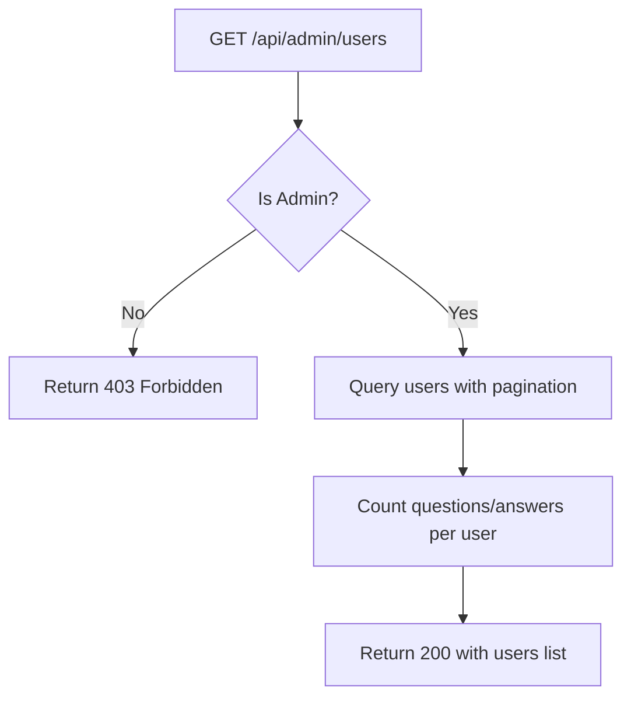

# Task: Admin - Get All Users

**Endpoint**: `GET /api/admin/users`

## 1. API Documentation

- **Method**: `GET`
- **URL**: `/api/admin/users`
- **Access**: Private (Admin only)
- **Query Params**:
  - `page` (default: 1)
  - `limit` (default: 20)
  - `search` (optional - search by name/email)
- **Response (200 OK)**:
  ```json
  {
    "success": true,
    "users": [
      {
        "id": 1,
        "firstName": "Abebe",
        "lastName": "Kebede",
        "email": "abebe@test.com",
        "role": "user",
        "questionCount": 15,
        "answerCount": 42,
        "createdAt": "2026-01-15T10:00:00Z",
        "status": "active"
      }
    ],
    "pagination": {
      "total": 100,
      "page": 1,
      "limit": 20,
      "totalPages": 5
    }
  }
  ```

## 2. Instructions

1. Implement `adminController` in `admin.controller.js`.
2. In `admin.service.js`, write `getAllUsersService`:
   - Check if user is admin.
   - Query `users` table with pagination and search.
   - Count questions and answers per user.
   - Return users list.

## 3. Logic Diagram


