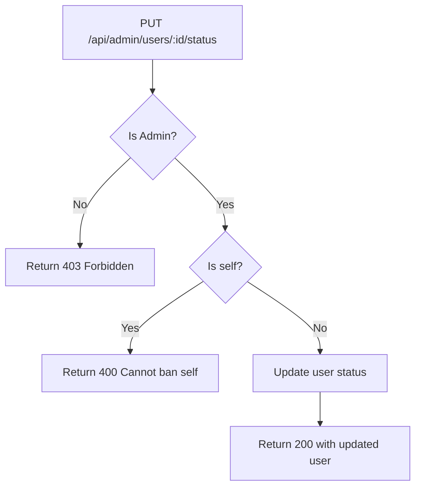

# Task: Admin - Update User Status

**Endpoint**: `PUT /api/admin/users/:userId/status`

## 1. API Documentation

- **Method**: `PUT`
- **URL**: `PUT /api/admin/users/:userId/status`
- **Access**: Private (Admin only)
- **Content-Type**: `application/json`
- **Request Body**:
  ```json
  {
    "status": "active | banned | suspended"
  }
  ```
- **Response (200 OK)**:
  ```json
  {
    "success": true,
    "message": "User status updated",
    "user": {
      "id": 1,
      "status": "banned"
    }
  }
  ```

## 2. Instructions

1. Implement `adminController` in `admin.controller.js`.
2. In `admin.service.js`, write `updateUserStatusService`:
   - Check if requester is admin.
   - Prevent admin from banning themselves.
   - Update user status in database.
   - Return updated user.

## 3. Logic Diagram


