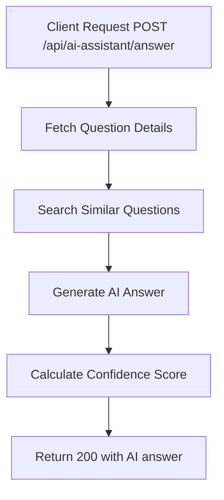

# Task: AI Smart Assistant

**Endpoint**: `POST /api/ai-assistant/answer`

## 1. API Documentation

- **Method**: `POST`
- **URL**: `/api/ai-assistant/answer`
- **Access**: Private (Authenticated Users)
- **Content-Type**: `application/json`
- **Request Body**:
  ```json
  {
    "questionId": "uuid",
    "context": "optional additional context"
  }
  ```
- **Response (200 OK)**:
  ```json
  {
    "success": true,
    "answer": {
      "content": "AI-generated answer based on the question...",
      "confidence": 0.85,
      "sources": ["similar-question-1", "similar-question-2"],
      "generatedAt": "2026-06-20T10:00:00Z"
    }
  }
  ```

## 2. Instructions

1. Implement `aiAssistantController` in `ai-assistant.controller.js`.
2. In `ai-assistant.service.js`, write `getAIAnswerService`:
   - Fetch question details from database.
   - Search for similar questions using vector embeddings.
   - Generate AI answer using OpenAI/Gemini API.
   - Include confidence score and source references.
   - Return structured answer.

## 3. Logic & Git Instructions

### Logic Steps

1. **Fetch Question**: Get question details from `questions` table.
2. **Find Similar**: Use vector search to find related Q&A.
3. **Generate Answer**: Call AI API with question context.
4. **Calculate Confidence**: Determine answer confidence score.
5. **Return Payload**: Send back AI-generated answer.

### Git Workflow

```bash
git checkout main
git pull origin main
git checkout -b feature/T-38-ai-assistant
# Make your changes
git add .
git commit -m "[T-38] Implement AI smart assistant"
git push origin feature/T-38-ai-assistant
```

### PR Checklist (include in every PR description)

```markdown
- [ ] Code compiles with no errors (`npm run dev` starts cleanly)
- [ ] Postman tests pass for all endpoints in this task
- [ ] AI generates relevant answers
- [ ] All acceptance criteria from the task are met
- [ ] Files match the exact paths listed in the task
```

## 4. Logic Diagram


