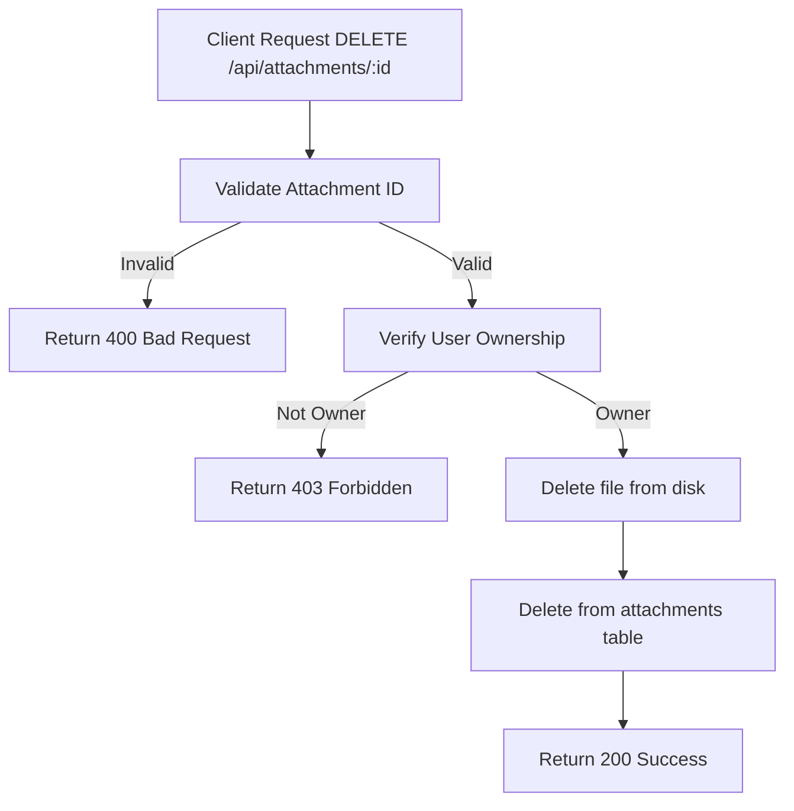

# Task: Delete Attachment

**Endpoint**: `DELETE /api/attachments/:attachmentId`

## 1. API Documentation

- **Method**: `DELETE`
- **URL**: `/api/attachments/:attachmentId`
- **Access**: Private (Owner only)
- **Response (200 OK)**:
  ```json
  {
    "success": true,
    "message": "Attachment deleted successfully"
  }
  ```

## 2. Instructions

1. Implement `deleteAttachmentController` in `attachment.controller.js`.
2. In `attachment.service.js`, write `deleteAttachmentService`:
   - Verify user owns the attachment.
   - Delete file from disk.
   - Delete metadata from `attachments` table.
   - Return success message.

## 3. Logic & Git Instructions

### Logic Steps

1. **Validate ID**: Check attachmentId is valid.
2. **Auth Check**: Verify user owns the attachment.
3. **Database Query**: Fetch attachment metadata.
4. **Delete File**: Remove file from disk.
5. **Database Delete**: Remove metadata from `attachments` table.
6. **Return Success**: Send confirmation.

### Git Workflow

```bash
git checkout main
git pull origin main
git checkout -b feature/T-28-delete-attachment
# Make your changes
git add .
git commit -m "[T-28] Implement delete attachment endpoint"
git push origin feature/T-28-delete-attachment
```

### PR Checklist (include in every PR description)

```markdown
- [ ] Code compiles with no errors (`npm run dev` starts cleanly)
- [ ] Postman tests pass for all endpoints in this task
- [ ] File deleted from disk and database
- [ ] All acceptance criteria from the task are met
- [ ] Files match the exact paths listed in the task
```

## 4. Logic Diagram


