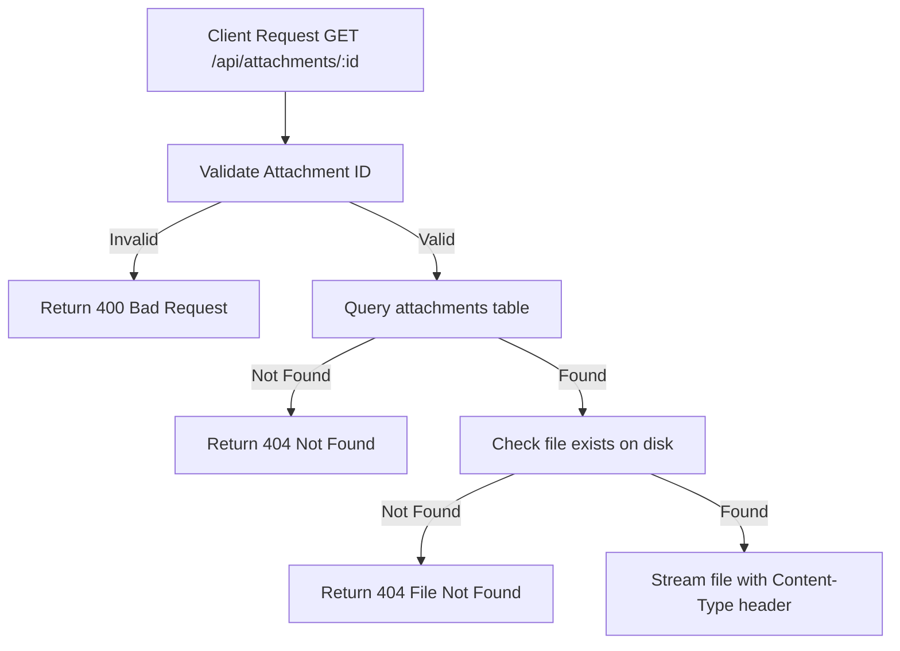

# Task: Get Attachment

**Endpoint**: `GET /api/attachments/:attachmentId`

## 1. API Documentation

- **Method**: `GET`
- **URL**: `/api/attachments/:attachmentId`
- **Access**: Public
- **Response (200 OK)**:
  - Returns file stream with appropriate Content-Type header
  - For images: `image/png`, `image/jpeg`, `image/gif`
  - For documents: `application/pdf`

## 2. Instructions

1. Implement `getAttachmentController` in `attachment.controller.js`.
2. In `attachment.service.js`, write `getAttachmentService`:
   - Query `attachments` table to get file metadata.
   - Check if file exists on disk.
   - Stream file with correct Content-Type header.
   - Handle file not found errors.

## 3. Logic & Git Instructions

### Logic Steps

1. **Validate ID**: Check attachmentId is valid.
2. **Database Query**: Fetch attachment metadata from `attachments` table.
3. **File Check**: Verify file exists on disk.
4. **Stream File**: Return file stream with correct headers.

### Git Workflow

```bash
git checkout main
git pull origin main
git checkout -b feature/T-27-get-attachment
# Make your changes
git add .
git commit -m "[T-27] Implement get attachment endpoint"
git push origin feature/T-27-get-attachment
```

### PR Checklist (include in every PR description)

```markdown
- [ ] Code compiles with no errors (`npm run dev` starts cleanly)
- [ ] Postman tests pass for all endpoints in this task
- [ ] Files download correctly with proper Content-Type
- [ ] All acceptance criteria from the task are met
- [ ] Files match the exact paths listed in the task
```

## 4. Logic Diagram


