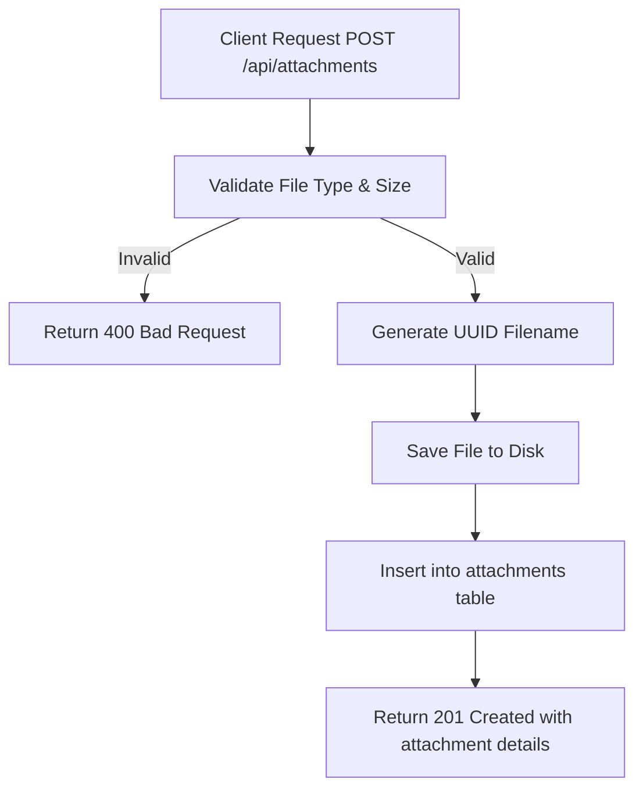

# Task: Upload Attachment

**Endpoint**: `POST /api/attachments`

## 1. API Documentation

- **Method**: `POST`
- **URL**: `/api/attachments`
- **Access**: Private (Authenticated Users)
- **Content-Type**: `multipart/form-data`
- **Request Body**:
  ```
  file: File (image/png, image/jpeg, image/gif, application/pdf, max 10MB)
  questionId: string (optional)
  answerId: string (optional)
  ```
- **Response (201 Created)**:
  ```json
  {
    "success": true,
    "message": "Attachment uploaded successfully",
    "attachment": {
      "id": "uuid",
      "fileName": "image.png",
      "fileType": "image/png",
      "fileSize": 1024000,
      "fileUrl": "/api/attachments/uuid",
      "uploadedBy": 1,
      "createdAt": "2026-06-20T10:00:00Z"
    }
  }
  ```

## 2. Instructions

1. Create `attachment.validation.js` to validate file type and size.
2. Implement `attachmentController` in `attachment.controller.js` to handle file upload.
3. In `attachment.service.js`, write `uploadAttachmentService`:
   - Validate file type (images: png, jpeg, gif; documents: pdf).
   - Validate file size (max 10MB).
   - Generate unique filename using UUID.
   - Save file to `/uploads/attachments/` directory.
   - Insert attachment metadata into `attachments` table.
   - Return attachment details.

## 3. Logic & Git Instructions

### Logic Steps

1. **Validate Input**: Check file exists and meets type/size requirements.
2. **Generate UUID**: Create unique identifier for the file.
3. **Save File**: Write file to disk with UUID as filename.
4. **Database Insert**: Store attachment metadata in `attachments` table.
5. **Return Payload**: Send back attachment details with download URL.

### Git Workflow

```bash
git checkout main
git pull origin main
git checkout -b feature/T-26-upload-attachment
# Make your changes
git add .
git commit -m "[T-26] Implement file attachment upload"
git push origin feature/T-26-upload-attachment
```

### PR Checklist (include in every PR description)

```markdown
- [ ] Code compiles with no errors (`npm run dev` starts cleanly)
- [ ] Postman tests pass for all endpoints in this task
- [ ] File uploads correctly to /uploads/attachments/
- [ ] All acceptance criteria from the task are met
- [ ] Files match the exact paths listed in the task
```

## 4. Logic Diagram


