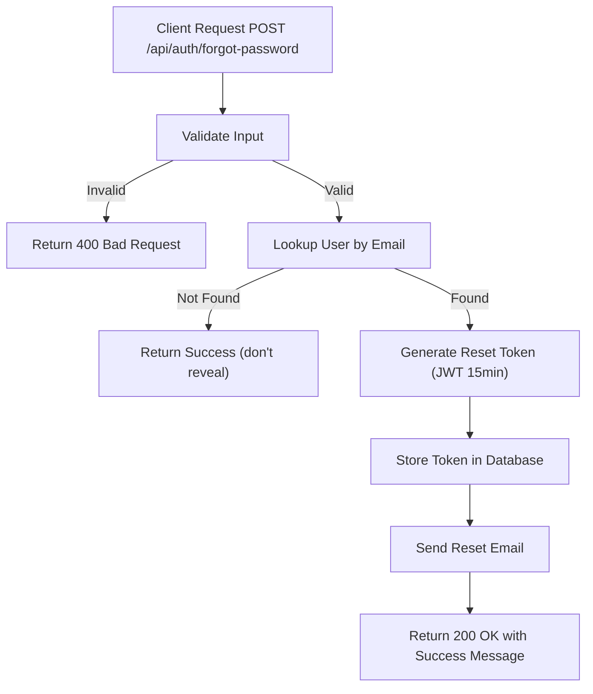

# Task: Forgot Password

**Endpoint**: `POST /api/auth/forgot-password`

## 1. API Documentation

- **Method**: `POST`
- **URL**: `/api/auth/forgot-password`
- **Access**: Public
- **Content-Type**: `application/json`
- **Request Body**:
  ```json
  {
    "email": "string (valid email, required)"
  }
  ```
- **Response (200 OK)**:
  ```json
  {
    "success": true,
    "message": "Password reset link sent to your email address."
  }
  ```

## 2. Instructions

1. Add `forgotPasswordValidation` in `auth.validation.js` to validate `email` is provided.
2. Implement `forgotPasswordController` in `auth.controller.js` to extract email from `req.body`.
3. In `auth.service.js`, write `forgotPasswordService`:
   - Normalize and lookup the user by `email` in the `users` table.
   - Generate a password reset token (JWT with short expiry, e.g., 15 minutes).
   - Store the token and expiry in a `password_resets` table or update user record.
   - Send the reset link via email using a mail service (e.g., Nodemailer with SMTP).
   - Return success message (always return same message even if user not found for security).

## 3. Logic & Git Instructions

### Logic Steps

1. **Validate Input**: Check that `email` field is provided in the request body.
2. **Lookup User**: Query the `users` table by the provided email. If user doesn't exist, still return success (don't reveal if email exists).
3. **Generate Reset Token**: Create a JWT containing the user's `id` and `email`, signed with `process.env.JWT_SECRET`, with a short expiry (15 minutes).
4. **Store Token**: Insert reset token and expiry into `password_resets` table, or update `reset_token` and `reset_token_expiry` columns in `users` table.
5. **Send Email**: Use Nodemailer to send reset link: `${FRONTEND_URL}/auth/reset-password?token=${token}`.
6. **Return Payload**: Send success message back to the client.

### Git Workflow

```bash
git checkout main
git pull origin main
git checkout -b feature/T-31-auth-forgot-password
# Make your changes
git add .
git commit -m "[T-31] Implement forgot password endpoint"
git push origin feature/T-31-auth-forgot-password
```

### PR Checklist (include in every PR description)
```markdown
- [ ] Code compiles with no errors (`npm run dev` starts cleanly)
- [ ] Postman tests pass for all endpoints in this task (backend tasks)
- [ ] Email is sent with valid reset link
- [ ] All acceptance criteria from the task are met
- [ ] Files match the exact paths listed in the task
```

## 4. Logic Diagram



## 5. Database Schema (New Table)

```sql
CREATE TABLE password_resets (
  id INT AUTO_INCREMENT PRIMARY KEY,
  user_id INT NOT NULL,
  token VARCHAR(500) NOT NULL,
  expires_at DATETIME NOT NULL,
  created_at TIMESTAMP DEFAULT CURRENT_TIMESTAMP,
  FOREIGN KEY (user_id) REFERENCES users(user_id) ON DELETE CASCADE
);
```
