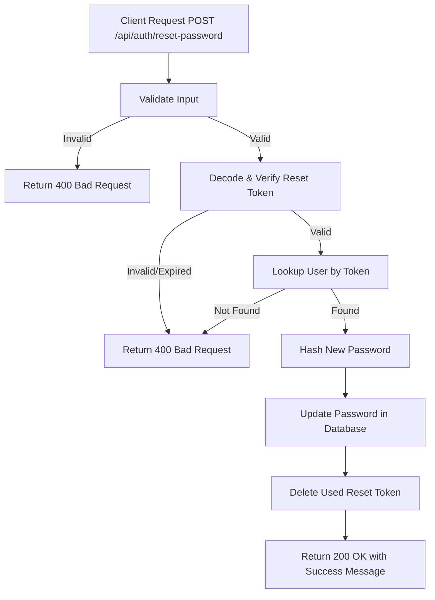

# Task: Reset Password

**Endpoint**: `POST /api/auth/reset-password`

## 1. API Documentation

- **Method**: `POST`
- **URL**: `/api/auth/reset-password`
- **Access**: Public (requires valid reset token)
- **Content-Type**: `application/json`
- **Request Body**:
  ```json
  {
    "token": "string (reset token from email, required)",
    "password": "string (new password, required)"
  }
  ```
- **Response (200 OK)**:
  ```json
  {
    "success": true,
    "message": "Password has been reset successfully."
  }
  ```

## 2. Instructions

1. Add `resetPasswordValidation` in `auth.validation.js` to validate `token` and `password` are provided.
2. Implement `resetPasswordController` in `auth.controller.js` to extract token and password from `req.body`.
3. In `auth.service.js`, write `resetPasswordService`:
   - Verify the reset token is valid and not expired.
   - Hash the new password using bcrypt.
   - Update the user's `password_hash` in the `users` table.
   - Delete the used reset token from `password_resets` table.
   - Return success message.

## 3. Logic & Git Instructions

### Logic Steps

1. **Validate Input**: Check that both `token` and `password` fields are provided in the request body.
2. **Verify Token**: Decode the JWT token, check it hasn't expired, and verify it exists in `password_resets` table.
3. **Find User**: Lookup user by `user_id` from the token payload.
4. **Hash Password**: Use `bcrypt.genSalt(10)` and `bcrypt.hash(password, salt)` to hash the new password.
5. **Update Password**: Update `password_hash` in `users` table for the user.
6. **Delete Token**: Remove the used reset token from `password_resets` table.
7. **Return Payload**: Send success message back to the client.

### Git Workflow

```bash
git checkout main
git pull origin main
git checkout -b feature/T-31-auth-reset-password
# Make your changes
git add .
git commit -m "[T-31] Implement reset password endpoint"
git push origin feature/T-31-auth-reset-password
```

### PR Checklist (include in every PR description)
```markdown
- [ ] Code compiles with no errors (`npm run dev` starts cleanly)
- [ ] Postman tests pass for all endpoints in this task (backend tasks)
- [ ] Password is updated correctly
- [ ] Reset token is deleted after use
- [ ] Expired/invalid tokens are rejected
- [ ] All acceptance criteria from the task are met
- [ ] Files match the exact paths listed in the task
```

## 4. Logic Diagram



## 5. Files to Modify

- `backend/src/api/auth/validations/auth.validation.js` - Add `resetPasswordValidation`
- `backend/src/api/auth/controller/auth.controller.js` - Add `forgotPasswordController`, `resetPasswordController`
- `backend/src/api/auth/service/auth.service.js` - Add `forgotPasswordService`, `resetPasswordService`
- `backend/src/api/auth/routes/auth.routes.js` - Add new routes
- `backend/db/config.js` - Add `password_resets` table if not exists
