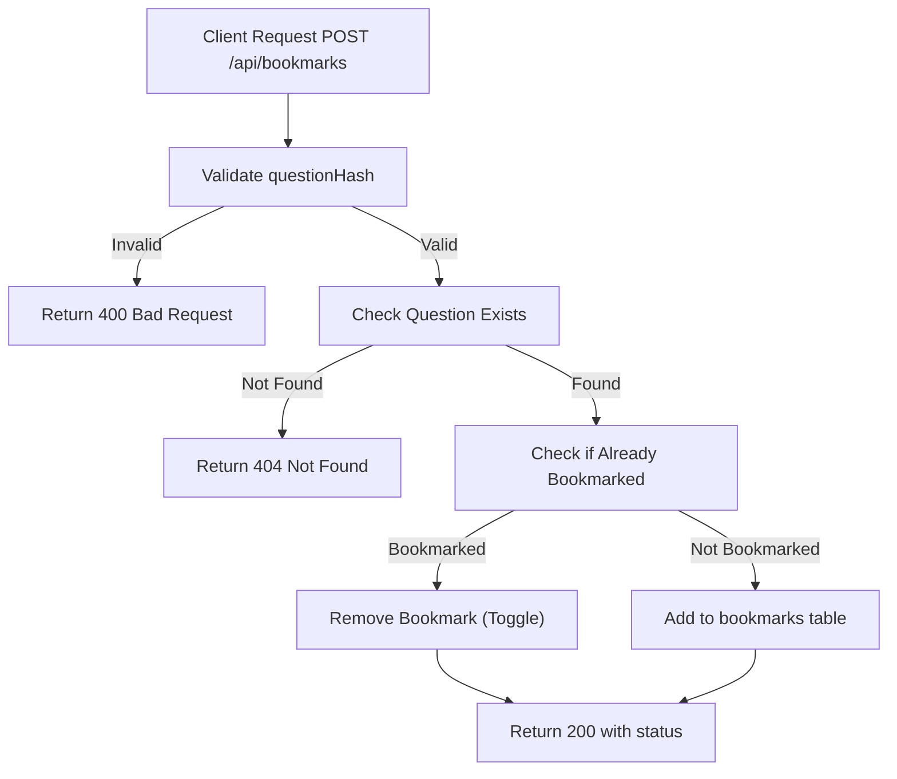

# Task: Add Question Bookmark

**Endpoint**: `POST /api/bookmarks`

## 1. API Documentation

- **Method**: `POST`
- **URL**: `/api/bookmarks`
- **Access**: Private (Authenticated Users)
- **Content-Type**: `application/json`
- **Request Body**:
  ```json
  {
    "questionHash": "abc123"
  }
  ```
- **Response (201 Created)**:
  ```json
  {
    "success": true,
    "message": "Question bookmarked successfully",
    "bookmark": {
      "id": 1,
      "questionHash": "abc123",
      "userId": 1,
      "createdAt": "2026-06-20T10:00:00Z"
    }
  }
  ```

## 2. Instructions

1. Create `bookmark.validation.js` to validate questionHash.
2. Implement `bookmarkController` in `bookmark.controller.js`.
3. In `bookmark.service.js`, write `addBookmarkService`:
   - Check if question exists.
   - Check if already bookmarked (toggle behavior).
   - Insert into `bookmarks` table.
   - Return bookmark details.

## 3. Logic & Git Instructions

### Logic Steps

1. **Validate Input**: Check questionHash is provided.
2. **Check Question**: Verify question exists.
3. **Check Duplicate**: If already bookmarked, remove it (toggle).
4. **Database Insert**: If not bookmarked, add to `bookmarks` table.
5. **Return Payload**: Send back bookmark status.

### Git Workflow

```bash
git checkout main
git pull origin main
git checkout -b feature/T-55-add-bookmark
# Make your changes
git add .
git commit -m "[T-55] Implement add question bookmark"
git push origin feature/T-55-add-bookmark
```

### PR Checklist (include in every PR description)

```markdown
- [ ] Code compiles with no errors (`npm run dev` starts cleanly)
- [ ] Postman tests pass for all endpoints in this task
- [ ] Bookmark toggles correctly
- [ ] All acceptance criteria from the task are met
- [ ] Files match the exact paths listed in the task
```

## 4. Logic Diagram


