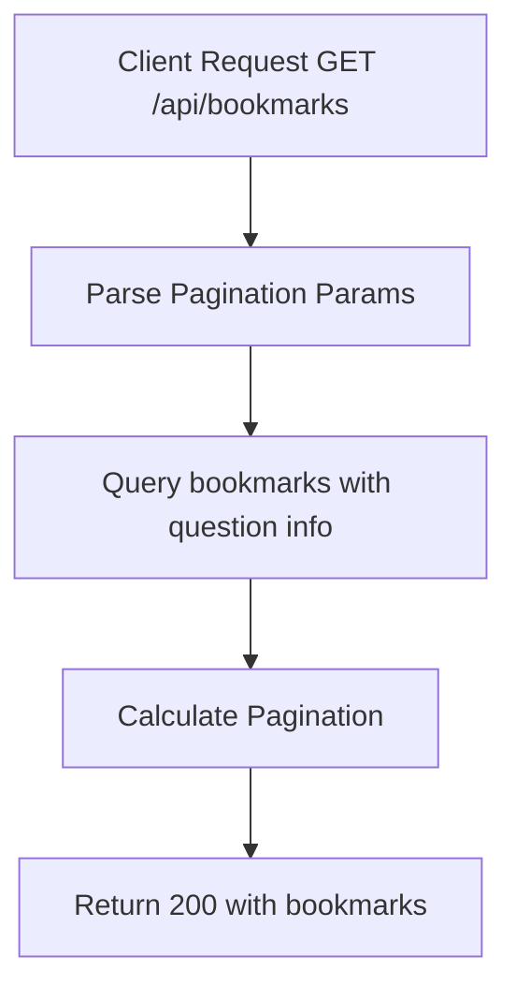

# Task: List User Bookmarks

**Endpoint**: `GET /api/bookmarks`

## 1. API Documentation

- **Method**: `GET`
- **URL**: `/api/bookmarks`
- **Access**: Private (Authenticated Users)
- **Query Params**:
  - `page` (default: 1)
  - `limit` (default: 20)
- **Response (200 OK)**:
  ```json
  {
    "success": true,
    "bookmarks": [
      {
        "id": 1,
        "questionHash": "abc123",
        "title": "How to center a div?",
        "author": "Abebe",
        "answerCount": 5,
        "bookmarkedAt": "2026-06-20T10:00:00Z"
      }
    ],
    "pagination": {
      "total": 15,
      "page": 1,
      "limit": 20,
      "totalPages": 1
    }
  }
  ```

## 2. Instructions

1. Implement `listBookmarksController` in `bookmark.controller.js`.
2. In `bookmark.service.js`, write `listBookmarksService`:
   - Query `bookmarks` table for authenticated user.
   - Join with `questions` table for question details.
   - Order by `bookmarkedAt` descending.
   - Return bookmarks with pagination.

## 3. Logic & Git Instructions

### Logic Steps

1. **Parse Pagination**: Extract page and limit from query params.
2. **Database Query**: Fetch bookmarks with question info.
3. **Calculate Pagination**: Determine total count and pages.
4. **Return Payload**: Send back bookmarks list.

### Git Workflow

```bash
git checkout main
git pull origin main
git checkout -b feature/T-55-list-bookmarks
# Make your changes
git add .
git commit -m "[T-55] Implement list user bookmarks"
git push origin feature/T-55-list-bookmarks
```

### PR Checklist (include in every PR description)

```markdown
- [ ] Code compiles with no errors (`npm run dev` starts cleanly)
- [ ] Postman tests pass for all endpoints in this task
- [ ] Bookmarks list correctly
- [ ] All acceptance criteria from the task are met
- [ ] Files match the exact paths listed in the task
```

## 4. Logic Diagram


