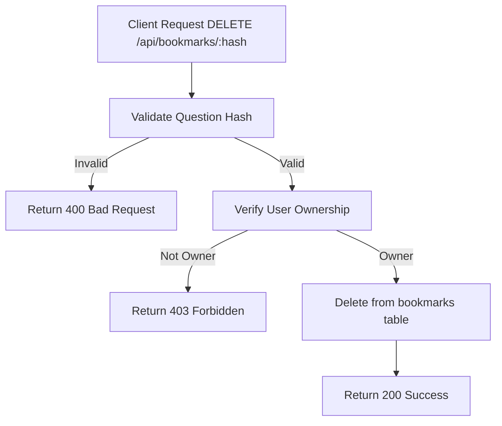

# Task: Remove Bookmark

**Endpoint**: `DELETE /api/bookmarks/:questionHash`

## 1. API Documentation

- **Method**: `DELETE`
- **URL**: `/api/bookmarks/:questionHash`
- **Access**: Private (Owner only)
- **Response (200 OK)**:
  ```json
  {
    "success": true,
    "message": "Bookmark removed successfully"
  }
  ```

## 2. Instructions

1. Implement `removeBookmarkController` in `bookmark.controller.js`.
2. In `bookmark.service.js`, write `removeBookmarkService`:
   - Verify bookmark belongs to authenticated user.
   - Delete from `bookmarks` table.
   - Return success message.

## 3. Logic & Git Instructions

### Logic Steps

1. **Validate ID**: Check questionHash is valid.
2. **Auth Check**: Verify user owns the bookmark.
3. **Database Delete**: Remove from `bookmarks` table.
4. **Return Success**: Send confirmation.

### Git Workflow

```bash
git checkout main
git pull origin main
git checkout -b feature/T-55-remove-bookmark
# Make your changes
git add .
git commit -m "[T-55] Implement remove bookmark"
git push origin feature/T-55-remove-bookmark
```

### PR Checklist (include in every PR description)

```markdown
- [ ] Code compiles with no errors (`npm run dev` starts cleanly)
- [ ] Postman tests pass for all endpoints in this task
- [ ] Bookmark deleted correctly
- [ ] All acceptance criteria from the task are met
- [ ] Files match the exact paths listed in the task
```

## 4. Logic Diagram


