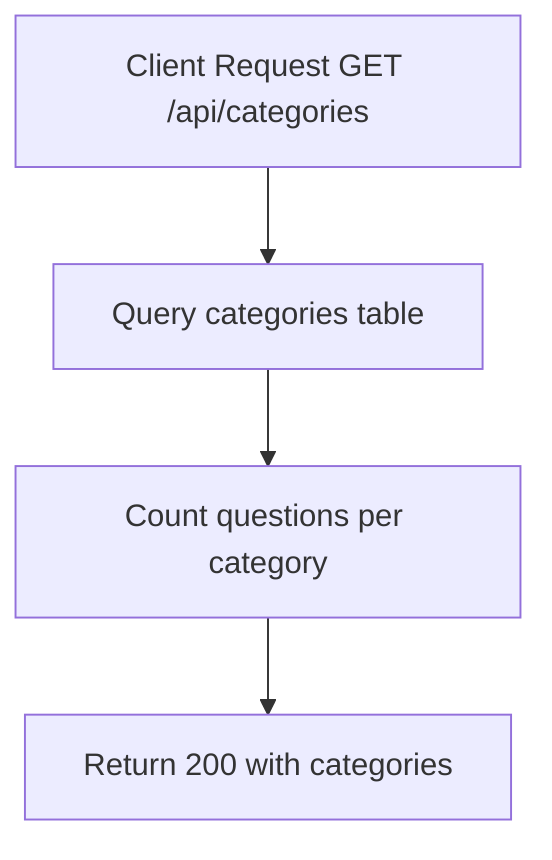

# Task: Get Categories

**Endpoint**: `GET /api/categories`

## 1. API Documentation

- **Method**: `GET`
- **URL**: `/api/categories`
- **Access**: Public
- **Response (200 OK)**:
  ```json
  {
    "success": true,
    "categories": [
      {
        "id": 1,
        "name": "JavaScript",
        "slug": "javascript",
        "questionCount": 45,
        "icon": "code"
      },
      {
        "id": 2,
        "name": "Python",
        "slug": "python",
        "questionCount": 32,
        "icon": "code"
      }
    ]
  }
  ```

## 2. Instructions

1. Implement `categoryController` in `category.controller.js`.
2. In `category.service.js`, write `getCategoriesService`:
   - Query `categories` table.
   - Count questions per category.
   - Return categories with question counts.

## 3. Logic & Git Instructions

### Logic Steps

1. **Database Query**: Fetch all categories.
2. **Count Questions**: Get question count per category.
3. **Return Payload**: Send back categories with counts.

### Git Workflow

```bash
git checkout main
git pull origin main
git checkout -b feature/T-41-get-categories
# Make your changes
git add .
git commit -m "[T-41] Implement get categories"
git push origin feature/T-41-get-categories
```

### PR Checklist (include in every PR description)

```markdown
- [ ] Code compiles with no errors (`npm run dev` starts cleanly)
- [ ] Postman tests pass for all endpoints in this task
- [ ] Categories list correctly with counts
- [ ] All acceptance criteria from the task are met
- [ ] Files match the exact paths listed in the task
```

## 4. Logic Diagram


