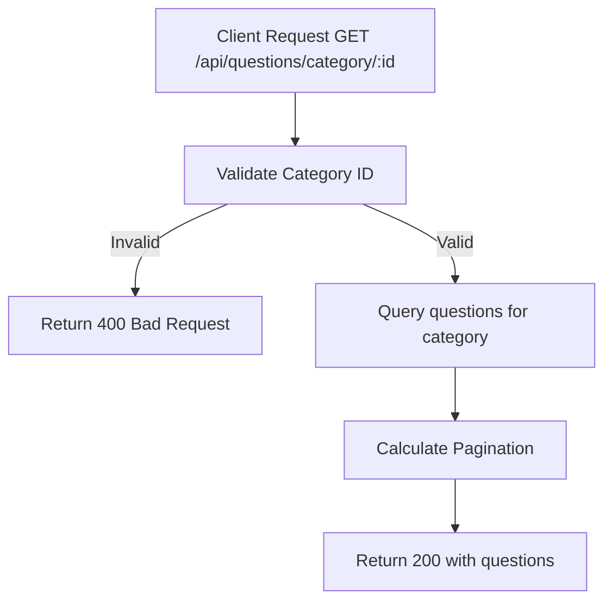

# Task: Get Questions by Category

**Endpoint**: `GET /api/questions/category/:categoryId`

## 1. API Documentation

- **Method**: `GET`
- **URL**: `/api/questions/category/:categoryId`
- **Access**: Public
- **Query Params**:
  - `page` (default: 1)
  - `limit` (default: 20)
- **Response (200 OK)**:
  ```json
  {
    "success": true,
    "category": {
      "id": 1,
      "name": "JavaScript",
      "slug": "javascript"
    },
    "questions": [
      {
        "questionHash": "abc123",
        "title": "How to center a div?",
        "author": "Abebe",
        "answerCount": 5,
        "createdAt": "2026-06-20T10:00:00Z"
      }
    ],
    "pagination": {
      "total": 45,
      "page": 1,
      "limit": 20,
      "totalPages": 3
    }
  }
  ```

## 2. Instructions

1. Implement `categoryController` in `category.controller.js`.
2. In `category.service.js`, write `getQuestionsByCategoryService`:
   - Validate category exists.
   - Query questions filtered by category.
   - Join with users table for author info.
   - Return questions with pagination.

## 3. Logic & Git Instructions

### Logic Steps

1. **Validate Category**: Check categoryId is valid.
2. **Database Query**: Fetch questions for category.
3. **Calculate Pagination**: Determine total count and pages.
4. **Return Payload**: Send back questions with pagination.

### Git Workflow

```bash
git checkout main
git pull origin main
git checkout -b feature/T-42-questions-by-category
# Make your changes
git add .
git commit -m "[T-42] Implement get questions by category"
git push origin feature/T-42-questions-by-category
```

### PR Checklist (include in every PR description)

```markdown
- [ ] Code compiles with no errors (`npm run dev` starts cleanly)
- [ ] Postman tests pass for all endpoints in this task
- [ ] Questions filter correctly by category
- [ ] All acceptance criteria from the task are met
- [ ] Files match the exact paths listed in the task
```

## 4. Logic Diagram


