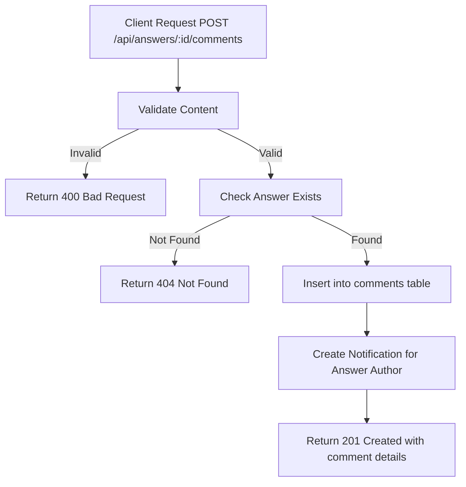

# Task: Add Comment to Answer

**Endpoint**: `POST /api/answers/:answerId/comments`

## 1. API Documentation

- **Method**: `POST`
- **URL**: `/api/answers/:answerId/comments`
- **Access**: Private (Authenticated Users)
- **Content-Type**: `application/json`
- **Request Body**:
  ```json
  {
    "content": "string (min 1 char, max 1000 chars, required)"
  }
  ```
- **Response (201 Created)**:
  ```json
  {
    "success": true,
    "message": "Comment added successfully",
    "comment": {
      "id": 1,
      "answerId": "uuid",
      "userId": 1,
      "content": "Great answer!",
      "createdAt": "2026-06-20T10:00:00Z"
    }
  }
  ```

## 2. Instructions

1. Create `comment.validation.js` to validate content.
2. Implement `commentController` in `comment.controller.js`.
3. In `comment.service.js`, write `createCommentService`:
   - Validate content length.
   - Check if answer exists.
   - Insert comment into `comments` table.
   - Create notification for answer author.
   - Return comment details.

## 3. Logic & Git Instructions

### Logic Steps

1. **Validate Input**: Check content meets length requirements.
2. **Check Answer**: Verify answer exists in `answers` table.
3. **Database Insert**: Store comment in `comments` table.
4. **Create Notification**: Notify answer author of new comment.
5. **Return Payload**: Send back comment details.

### Git Workflow

```bash
git checkout main
git pull origin main
git checkout -b feature/T-32-create-comment
# Make your changes
git add .
git commit -m "[T-32] Implement add comment to answer"
git push origin feature/T-32-create-comment
```

### PR Checklist (include in every PR description)

```markdown
- [ ] Code compiles with no errors (`npm run dev` starts cleanly)
- [ ] Postman tests pass for all endpoints in this task
- [ ] Comment saves correctly
- [ ] All acceptance criteria from the task are met
- [ ] Files match the exact paths listed in the task
```

## 4. Logic Diagram


