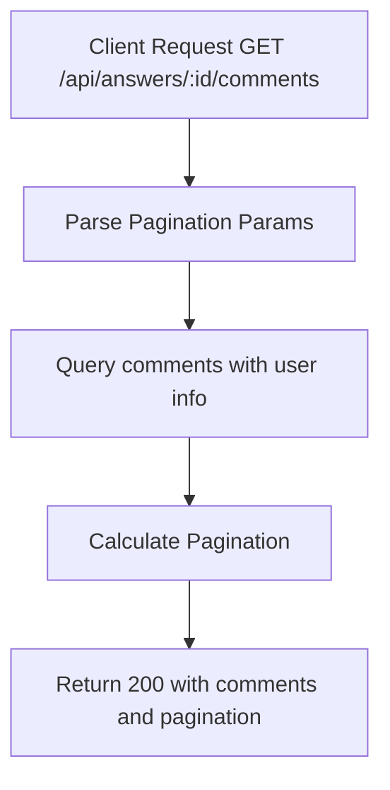

# Task: Get Comments for Answer

**Endpoint**: `GET /api/answers/:answerId/comments`

## 1. API Documentation

- **Method**: `GET`
- **URL**: `/api/answers/:answerId/comments`
- **Access**: Public
- **Query Params**:
  - `page` (default: 1)
  - `limit` (default: 20)
- **Response (200 OK)**:
  ```json
  {
    "success": true,
    "comments": [
      {
        "id": 1,
        "answerId": "uuid",
        "userId": 1,
        "firstName": "Abebe",
        "lastName": "Kebede",
        "content": "Great answer!",
        "createdAt": "2026-06-20T10:00:00Z"
      }
    ],
    "pagination": {
      "total": 5,
      "page": 1,
      "limit": 20,
      "totalPages": 1
    }
  }
  ```

## 2. Instructions

1. Implement `listCommentsController` in `comment.controller.js`.
2. In `comment.service.js`, write `listCommentsService`:
   - Query `comments` table with pagination.
   - Join with `users` table to get author names.
   - Order by `createdAt` ascending.
   - Return comments with pagination info.

## 3. Logic & Git Instructions

### Logic Steps

1. **Parse Pagination**: Extract page and limit from query params.
2. **Database Query**: Fetch comments with user info.
3. **Calculate Pagination**: Determine total count and pages.
4. **Return Payload**: Send back comments list with pagination.

### Git Workflow

```bash
git checkout main
git pull origin main
git checkout -b feature/T-33-list-comments
# Make your changes
git add .
git commit -m "[T-33] Implement list comments for answer"
git push origin feature/T-33-list-comments
```

### PR Checklist (include in every PR description)

```markdown
- [ ] Code compiles with no errors (`npm run dev` starts cleanly)
- [ ] Postman tests pass for all endpoints in this task
- [ ] Comments list correctly with pagination
- [ ] All acceptance criteria from the task are met
- [ ] Files match the exact paths listed in the task
```

## 4. Logic Diagram


