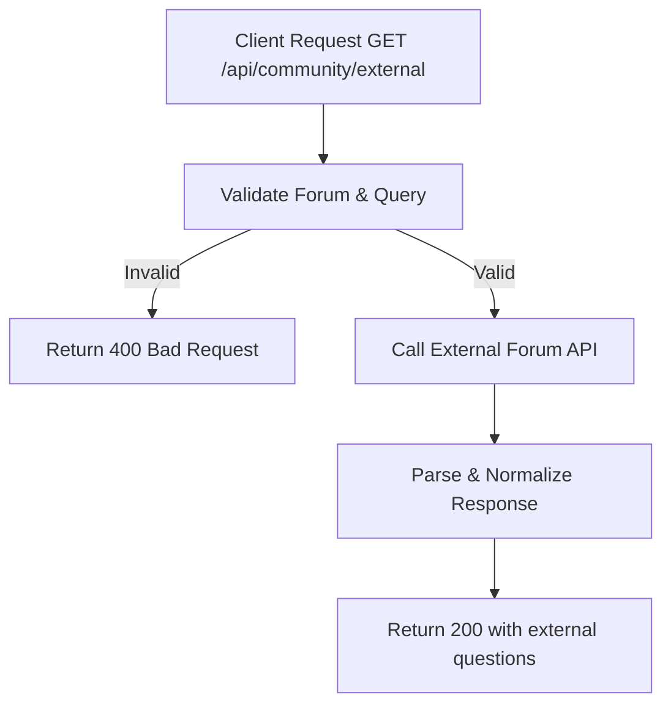

# Task: Get External Forum Content

**Endpoint**: `GET /api/community/external`

## 1. API Documentation

- **Method**: `GET`
- **URL**: `/api/community/external`
- **Access**: Public
- **Query Params**:
  - `forum` (e.g., "stackoverflow", "devto")
  - `query` (search query)
  - `limit` (default: 10)
- **Response (200 OK)**:
  ```json
  {
    "success": true,
    "forum": "stackoverflow",
    "questions": [
      {
        "externalId": "12345",
        "title": "How to center a div?",
        "url": "https://stackoverflow.com/questions/12345",
        "answerCount": 10,
        "score": 150
      }
    ]
  }
  ```

## 2. Instructions

1. Implement `communityController` in `community.controller.js`.
2. In `community.service.js`, write `getExternalForumContentService`:
   - Validate forum name.
   - Call external forum API (StackOverflow, Dev.to, etc.).
   - Parse and format response.
   - Return normalized question data.

## 3. Logic & Git Instructions

### Logic Steps

1. **Validate Input**: Check forum and query params.
2. **Call External API**: Fetch from forum's API.
3. **Parse Response**: Normalize data format.
4. **Return Payload**: Send back formatted questions.

### Git Workflow

```bash
git checkout main
git pull origin main
git checkout -b feature/T-43-external-forums
# Make your changes
git add .
git commit -m "[T-43] Implement external forum sync"
git push origin feature/T-43-external-forums
```

### PR Checklist (include in every PR description)

```markdown
- [ ] Code compiles with no errors (`npm run dev` starts cleanly)
- [ ] Postman tests pass for all endpoints in this task
- [ ] External forum data fetches correctly
- [ ] All acceptance criteria from the task are met
- [ ] Files match the exact paths listed in the task
```

## 4. Logic Diagram


