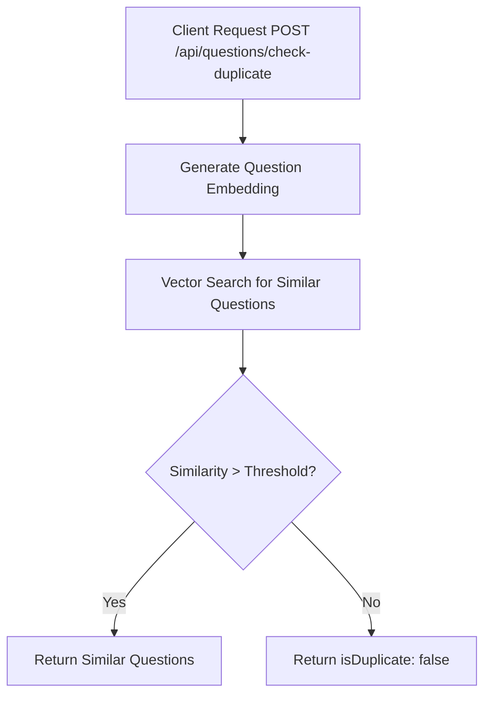

# Task: Detect Duplicate Questions

**Endpoint**: `POST /api/questions/check-duplicate`

## 1. API Documentation

- **Method**: `POST`
- **URL**: `/api/questions/check-duplicate`
- **Access**: Private (Authenticated Users)
- **Content-Type**: `application/json`
- **Request Body**:
  ```json
  {
    "title": "How to center a div in CSS?",
    "description": "I'm trying to center a div element horizontally and vertically..."
  }
  ```
- **Response (200 OK)**:
  ```json
  {
    "success": true,
    "isDuplicate": true,
    "similarQuestions": [
      {
        "questionHash": "abc123",
        "title": "CSS Center Div",
        "similarity": 0.92,
        "answerCount": 5
      }
    ],
    "recommendation": "Consider posting your question as a comment on the existing question."
  }
  ```

## 2. Instructions

1. Implement `duplicateController` in `duplicate.controller.js`.
2. In `duplicate.service.js`, write `checkDuplicateService`:
   - Generate embedding for new question title+description.
   - Search for similar questions using vector cosine similarity.
   - Set similarity threshold (e.g., 0.85).
   - Return similar questions if found.

## 3. Logic & Git Instructions

### Logic Steps

1. **Generate Embedding**: Create vector for new question.
2. **Vector Search**: Find questions with similar embeddings.
3. **Filter Results**: Apply similarity threshold.
4. **Return Payload**: Send back similar questions if any.

### Git Workflow

```bash
git checkout main
git pull origin main
git checkout -b feature/T-40-check-duplicate
# Make your changes
git add .
git commit -m "[T-40] Implement duplicate question detection"
git push origin feature/T-40-check-duplicate
```

### PR Checklist (include in every PR description)

```markdown
- [ ] Code compiles with no errors (`npm run dev` starts cleanly)
- [ ] Postman tests pass for all endpoints in this task
- [ ] Duplicate detection works correctly
- [ ] All acceptance criteria from the task are met
- [ ] Files match the exact paths listed in the task
```

## 4. Logic Diagram


