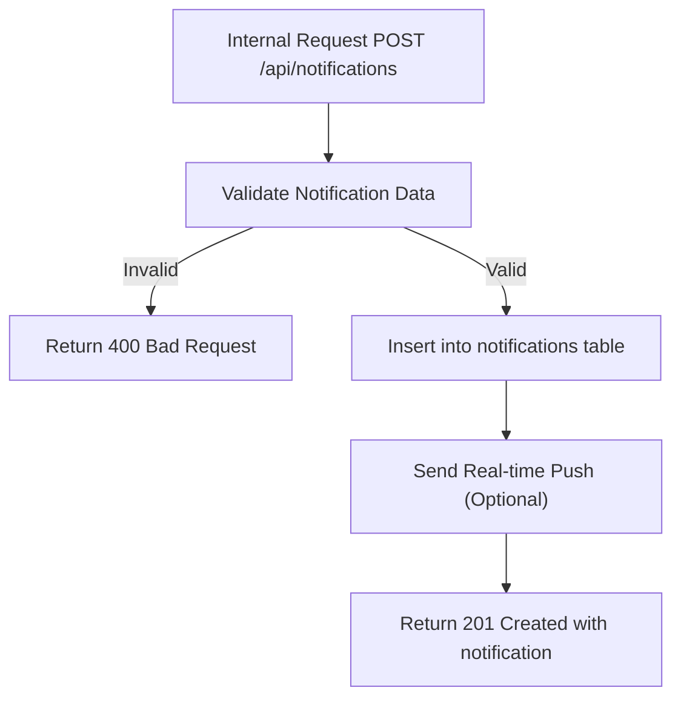

# Task: Create Notification

**Endpoint**: `POST /api/notifications`

## 1. API Documentation

- **Method**: `POST`
- **URL**: `/api/notifications`
- **Access**: Internal (System Only)
- **Content-Type**: `application/json`
- **Request Body**:
  ```json
  {
    "userId": 1,
    "type": "answer | comment | vote | mention",
    "referenceId": "uuid",
    "referenceType": "question | answer",
    "message": "Someone answered your question"
  }
  ```
- **Response (201 Created)**:
  ```json
  {
    "success": true,
    "notification": {
      "id": 1,
      "userId": 1,
      "type": "answer",
      "message": "Someone answered your question",
      "isRead": false,
      "createdAt": "2026-06-20T10:00:00Z"
    }
  }
  ```

## 2. Instructions

1. Implement `notificationController` in `notification.controller.js`.
2. In `notification.service.js`, write `createNotificationService`:
   - Validate notification type.
   - Insert notification into `notifications` table.
   - Optionally send real-time notification via WebSocket.
   - Return notification details.

## 3. Logic & Git Instructions

### Logic Steps

1. **Validate Input**: Check required fields.
2. **Database Insert**: Store notification in `notifications` table.
3. **Real-time Push**: Send via WebSocket if connected.
4. **Return Payload**: Send back notification details.

### Git Workflow

```bash
git checkout main
git pull origin main
git checkout -b feature/T-35-create-notification
# Make your changes
git add .
git commit -m "[T-35] Implement create notification"
git push origin feature/T-35-create-notification
```

### PR Checklist (include in every PR description)

```markdown
- [ ] Code compiles with no errors (`npm run dev` starts cleanly)
- [ ] Postman tests pass for all endpoints in this task
- [ ] Notification saves correctly
- [ ] All acceptance criteria from the task are met
- [ ] Files match the exact paths listed in the task
```

## 4. Logic Diagram


