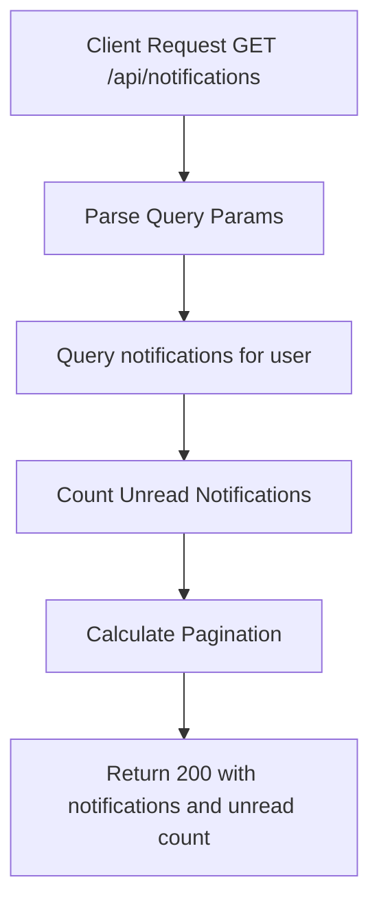

# Task: List User Notifications

**Endpoint**: `GET /api/notifications`

## 1. API Documentation

- **Method**: `GET`
- **URL**: `/api/notifications`
- **Access**: Private (Authenticated Users)
- **Query Params**:
  - `page` (default: 1)
  - `limit` (default: 20)
  - `unreadOnly` (default: false)
- **Response (200 OK)**:
  ```json
  {
    "success": true,
    "notifications": [
      {
        "id": 1,
        "type": "answer",
        "message": "Someone answered your question",
        "referenceId": "uuid",
        "referenceType": "question",
        "isRead": false,
        "createdAt": "2026-06-20T10:00:00Z"
      }
    ],
    "unreadCount": 5,
    "pagination": {
      "total": 25,
      "page": 1,
      "limit": 20,
      "totalPages": 2
    }
  }
  ```

## 2. Instructions

1. Implement `listNotificationsController` in `notification.controller.js`.
2. In `notification.service.js`, write `listNotificationsService`:
   - Query `notifications` table for authenticated user.
   - Support filtering by unread status.
   - Order by `createdAt` descending.
   - Count unread notifications.
   - Return notifications with pagination.

## 3. Logic & Git Instructions

### Logic Steps

1. **Parse Params**: Extract pagination and filter params.
2. **Database Query**: Fetch notifications for user.
3. **Count Unread**: Get total unread count.
4. **Calculate Pagination**: Determine total count and pages.
5. **Return Payload**: Send back notifications with unread count.

### Git Workflow

```bash
git checkout main
git pull origin main
git checkout -b feature/T-36-list-notifications
# Make your changes
git add .
git commit -m "[T-36] Implement list user notifications"
git push origin feature/T-36-list-notifications
```

### PR Checklist (include in every PR description)

```markdown
- [ ] Code compiles with no errors (`npm run dev` starts cleanly)
- [ ] Postman tests pass for all endpoints in this task
- [ ] Notifications list correctly with unread count
- [ ] All acceptance criteria from the task are met
- [ ] Files match the exact paths listed in the task
```

## 4. Logic Diagram


