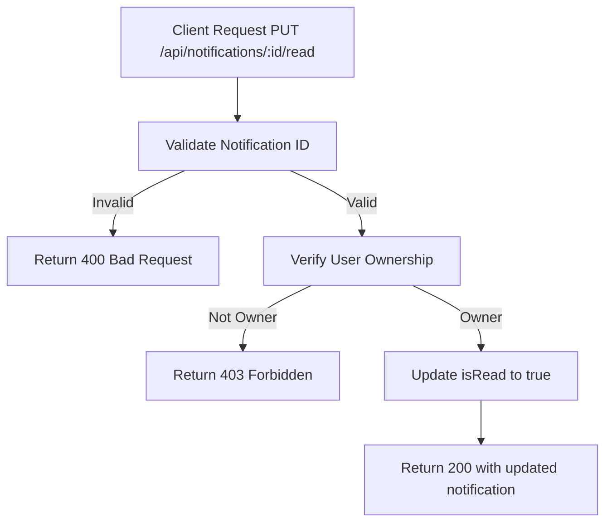

# Task: Mark Notification as Read

**Endpoint**: `PUT /api/notifications/:notificationId/read`

## 1. API Documentation

- **Method**: `PUT`
- **URL**: `/api/notifications/:notificationId/read`
- **Access**: Private (Owner only)
- **Response (200 OK)**:
  ```json
  {
    "success": true,
    "message": "Notification marked as read",
    "notification": {
      "id": 1,
      "isRead": true,
      "updatedAt": "2026-06-20T10:00:00Z"
    }
  }
  ```

## 2. Instructions

1. Implement `markReadController` in `notification.controller.js`.
2. In `notification.service.js`, write `markNotificationReadService`:
   - Verify notification belongs to authenticated user.
   - Update `isRead` to true.
   - Return updated notification.

## 3. Logic & Git Instructions

### Logic Steps

1. **Validate ID**: Check notificationId is valid.
2. **Auth Check**: Verify user owns the notification.
3. **Database Update**: Set `isRead` to true.
4. **Return Payload**: Send back updated notification.

### Git Workflow

```bash
git checkout main
git pull origin main
git checkout -b feature/T-37-mark-notification-read
# Make your changes
git add .
git commit -m "[T-37] Implement mark notification as read"
git push origin feature/T-37-mark-notification-read
```

### PR Checklist (include in every PR description)

```markdown
- [ ] Code compiles with no errors (`npm run dev` starts cleanly)
- [ ] Postman tests pass for all endpoints in this task
- [ ] Notification updates correctly
- [ ] All acceptance criteria from the task are met
- [ ] Files match the exact paths listed in the task
```

## 4. Logic Diagram


