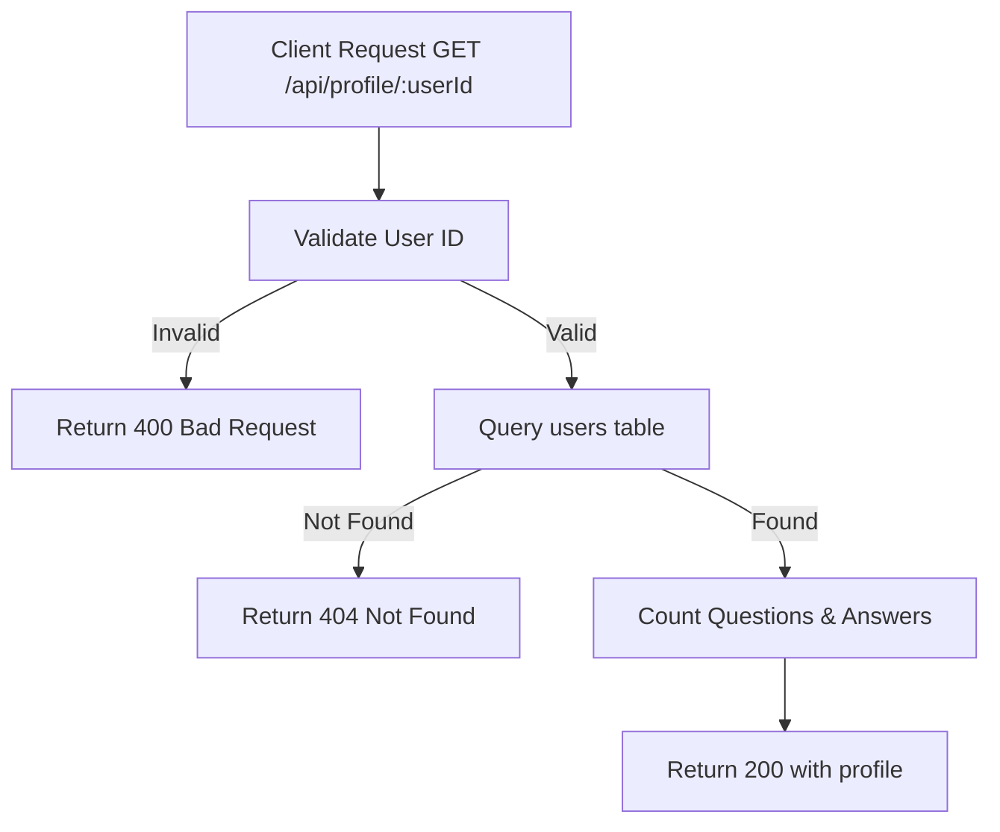

# Task: Get User Profile

**Endpoint**: `GET /api/profile/:userId`

## 1. API Documentation

- **Method**: `GET`
- **URL**: `/api/profile/:userId`
- **Access**: Public
- **Response (200 OK)**:
  ```json
  {
    "success": true,
    "profile": {
      "id": 1,
      "firstName": "Abebe",
      "lastName": "Kebede",
      "email": "abebe@test.com",
      "bio": "Software developer passionate about web technologies",
      "avatar": "/api/profile/1/avatar",
      "questionCount": 15,
      "answerCount": 42,
      "joinedAt": "2026-01-15T10:00:00Z"
    }
  }
  ```

## 2. Instructions

1. Implement `profileController` in `profile.controller.js`.
2. In `profile.service.js`, write `getProfileService`:
   - Query `users` table for user info.
   - Count questions and answers.
   - Return profile with stats.

## 3. Logic & Git Instructions

### Logic Steps

1. **Validate ID**: Check userId is valid.
2. **Database Query**: Fetch user info.
3. **Count Stats**: Get question and answer counts.
4. **Return Payload**: Send back profile with stats.

### Git Workflow

```bash
git checkout main
git pull origin main
git checkout -b feature/T-56-get-profile
# Make your changes
git add .
git commit -m "[T-56] Implement get user profile"
git push origin feature/T-56-get-profile
```

### PR Checklist (include in every PR description)

```markdown
- [ ] Code compiles with no errors (`npm run dev` starts cleanly)
- [ ] Postman tests pass for all endpoints in this task
- [ ] Profile displays correctly
- [ ] All acceptance criteria from the task are met
- [ ] Files match the exact paths listed in the task
```

## 4. Logic Diagram


