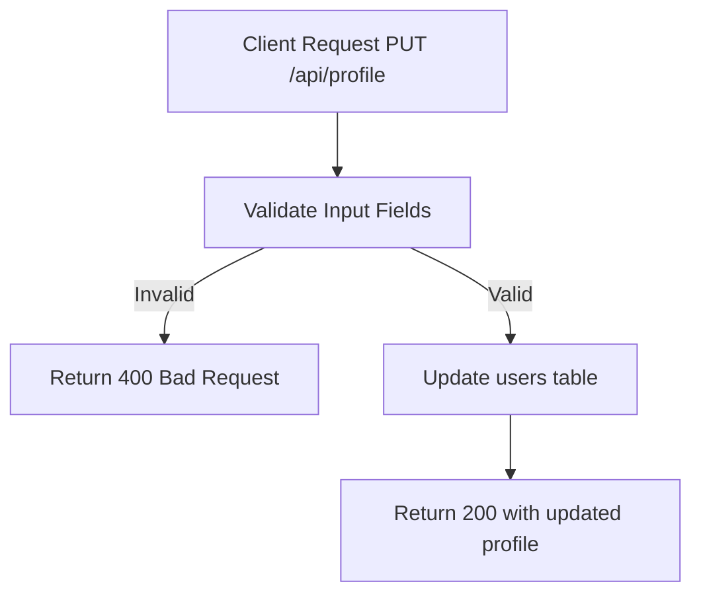

# Task: Update User Profile

**Endpoint**: `PUT /api/profile`

## 1. API Documentation

- **Method**: `PUT`
- **URL**: `/api/profile`
- **Access**: Private (Authenticated Users)
- **Content-Type**: `application/json`
- **Request Body**:
  ```json
  {
    "firstName": "Abebe (optional)",
    "lastName": "Kebede (optional)",
    "bio": "Updated bio text (optional)"
  }
  ```
- **Response (200 OK)**:
  ```json
  {
    "success": true,
    "message": "Profile updated successfully",
    "profile": {
      "id": 1,
      "firstName": "Abebe",
      "lastName": "Kebede",
      "bio": "Updated bio text"
    }
  }
  ```

## 2. Instructions

1. Create `profile.validation.js` to validate input fields.
2. Implement `profileController` in `profile.controller.js`.
3. In `profile.service.js`, write `updateProfileService`:
   - Validate input fields.
   - Update `users` table.
   - Return updated profile.

## 3. Logic & Git Instructions

### Logic Steps

1. **Validate Input**: Check field lengths and formats.
2. **Database Update**: Update user record.
3. **Return Payload**: Send back updated profile.

### Git Workflow

```bash
git checkout main
git pull origin main
git checkout -b feature/T-56-update-profile
# Make your changes
git add .
git commit -m "[T-56] Implement update user profile"
git push origin feature/T-56-update-profile
```

### PR Checklist (include in every PR description)

```markdown
- [ ] Code compiles with no errors (`npm run dev` starts cleanly)
- [ ] Postman tests pass for all endpoints in this task
- [ ] Profile updates correctly
- [ ] All acceptance criteria from the task are met
- [ ] Files match the exact paths listed in the task
```

## 4. Logic Diagram


