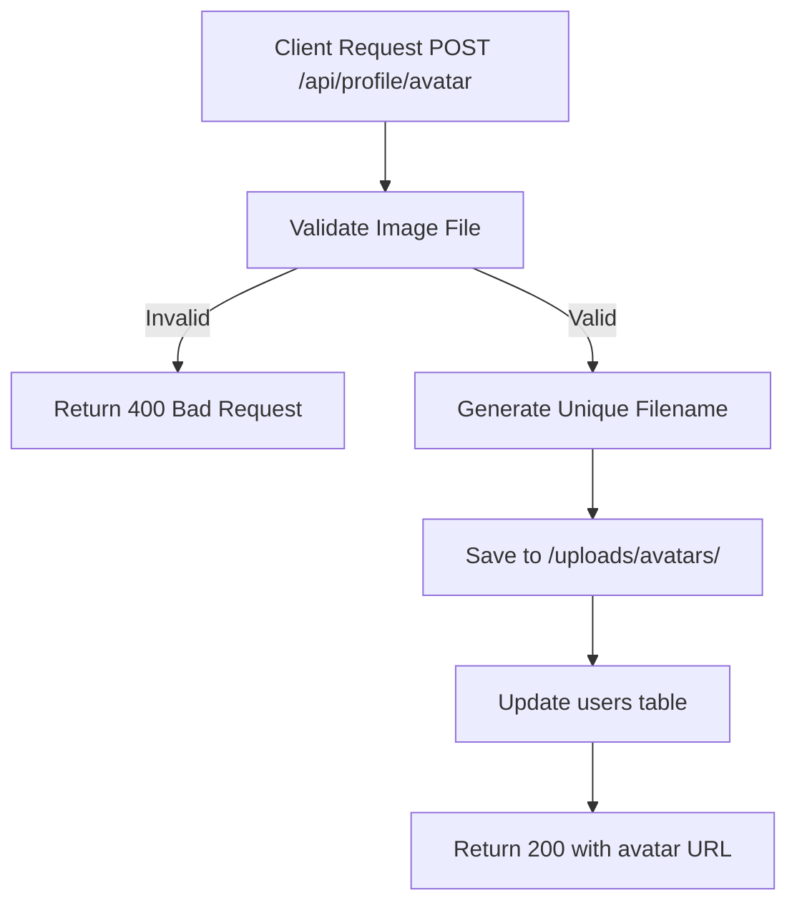

# Task: Upload Avatar

**Endpoint**: `POST /api/profile/avatar`

## 1. API Documentation

- **Method**: `POST`
- **URL**: `/api/profile/avatar`
- **Access**: Private (Authenticated Users)
- **Content-Type**: `multipart/form-data`
- **Request Body**:
  ```
  avatar: File (image/png, image/jpeg, max 5MB)
  ```
- **Response (200 OK)**:
  ```json
  {
    "success": true,
    "message": "Avatar uploaded successfully",
    "avatarUrl": "/api/profile/1/avatar"
  }
  ```

## 2. Instructions

1. Implement `profileController` in `profile.controller.js`.
2. In `profile.service.js`, write `uploadAvatarService`:
   - Validate image file type and size.
   - Generate unique filename.
   - Save to `/uploads/avatars/` directory.
   - Update user record with avatar path.
   - Return avatar URL.

## 3. Logic & Git Instructions

### Logic Steps

1. **Validate File**: Check image type and size.
2. **Generate Filename**: Create unique identifier.
3. **Save File**: Write to disk.
4. **Update Database**: Set avatar path in users table.
5. **Return Payload**: Send back avatar URL.

### Git Workflow

```bash
git checkout main
git pull origin main
git checkout -b feature/T-56-upload-avatar
# Make your changes
git add .
git commit -m "[T-56] Implement upload avatar"
git push origin feature/T-56-upload-avatar
```

### PR Checklist (include in every PR description)

```markdown
- [ ] Code compiles with no errors (`npm run dev` starts cleanly)
- [ ] Postman tests pass for all endpoints in this task
- [ ] Avatar uploads correctly
- [ ] All acceptance criteria from the task are met
- [ ] Files match the exact paths listed in the task
```

## 4. Logic Diagram


