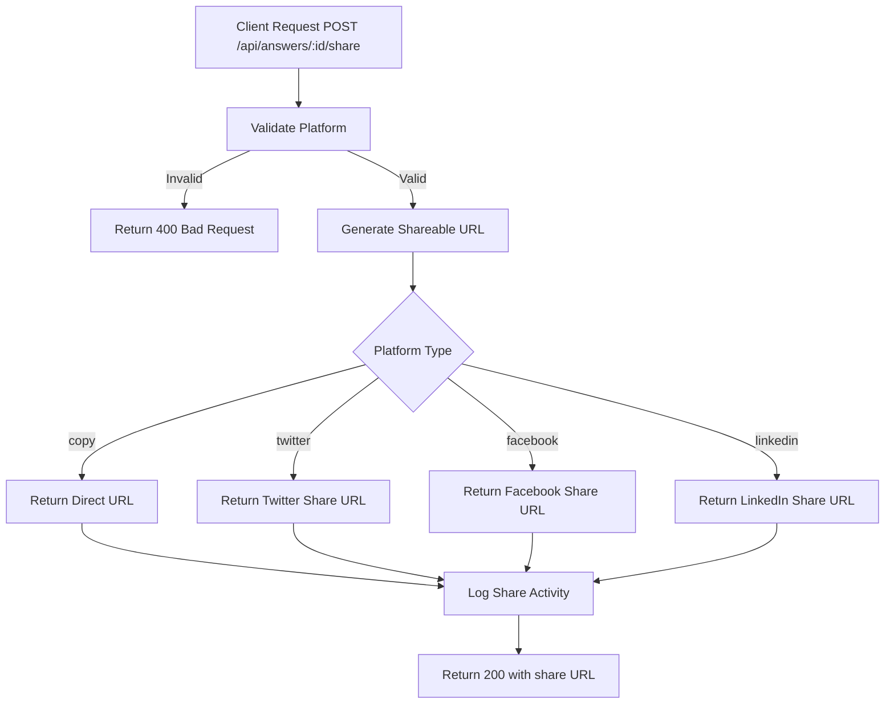

# Task: Share Answer

**Endpoint**: `POST /api/answers/:answerId/share`

## 1. API Documentation

- **Method**: `POST`
- **URL**: `/api/answers/:answerId/share`
- **Access**: Private (Authenticated Users)
- **Content-Type**: `application/json`
- **Request Body**:
  ```json
  {
    "platform": "copy | twitter | facebook | linkedin"
  }
  ```
- **Response (200 OK)**:
  ```json
  {
    "success": true,
    "message": "Share link generated",
    "shareUrl": "https://forum.evangadi.com/questions/abc123?answer=1",
    "platform": "copy"
  }
  ```

## 2. Instructions

1. Create `share.validation.js` to validate platform.
2. Implement `shareController` in `share.controller.js`.
3. In `share.service.js`, write `createShareService`:
   - Generate shareable URL for the answer.
   - For "copy", return direct URL.
   - For social platforms, return formatted share URLs.
   - Log share activity in `shares` table.

## 3. Logic & Git Instructions

### Logic Steps

1. **Validate Input**: Check platform is valid.
2. **Generate URL**: Create shareable link for the answer.
3. **Format for Platform**: Adjust URL format based on platform.
4. **Log Share**: Record share activity.
5. **Return Payload**: Send back share URL.

### Git Workflow

```bash
git checkout main
git pull origin main
git checkout -b feature/T-34-share-answer
# Make your changes
git add .
git commit -m "[T-34] Implement share answer functionality"
git push origin feature/T-34-share-answer
```

### PR Checklist (include in every PR description)

```markdown
- [ ] Code compiles with no errors (`npm run dev` starts cleanly)
- [ ] Postman tests pass for all endpoints in this task
- [ ] Share URLs generate correctly
- [ ] All acceptance criteria from the task are met
- [ ] Files match the exact paths listed in the task
```

## 4. Logic Diagram


