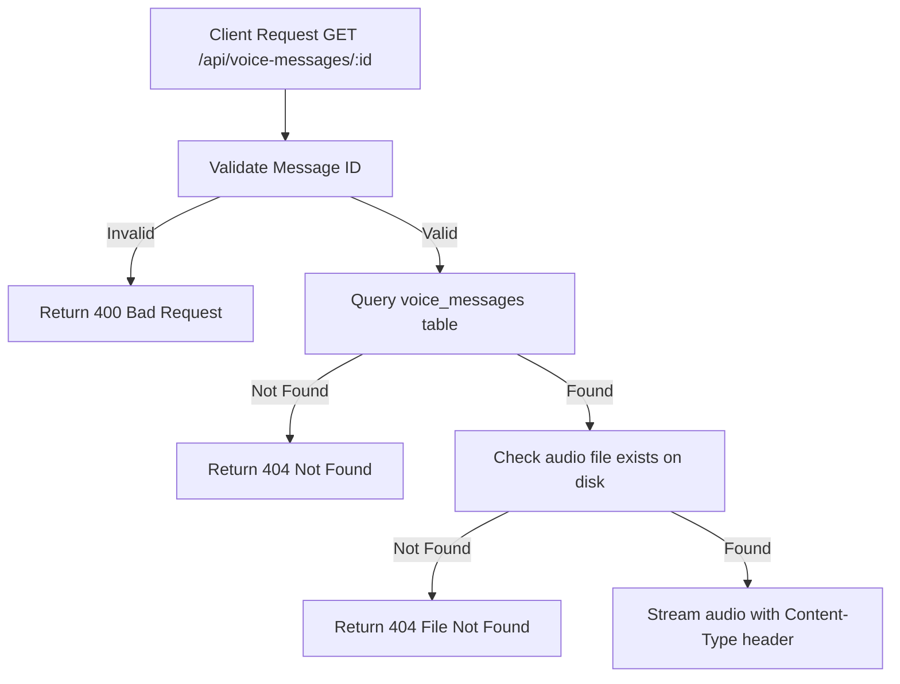

# Task: Get Voice Message

**Endpoint**: `GET /api/voice-messages/:messageId`

## 1. API Documentation

- **Method**: `GET`
- **URL**: `/api/voice-messages/:messageId`
- **Access**: Public
- **Response (200 OK)**:
  - Returns audio stream with appropriate Content-Type header
  - For audio: `audio/webm`, `audio/mp3`, `audio/wav`

## 2. Instructions

1. Implement `getVoiceMessageController` in `voice-message.controller.js`.
2. In `voice-message.service.js`, write `getVoiceMessageService`:
   - Query `voice_messages` table to get audio metadata.
   - Check if file exists on disk.
   - Stream audio file with correct Content-Type header.
   - Handle file not found errors.

## 3. Logic & Git Instructions

### Logic Steps

1. **Validate ID**: Check messageId is valid.
2. **Database Query**: Fetch voice message metadata from `voice_messages` table.
3. **File Check**: Verify audio file exists on disk.
4. **Stream Audio**: Return audio stream with correct headers.

### Git Workflow

```bash
git checkout main
git pull origin main
git checkout -b feature/T-30-get-voice
# Make your changes
git add .
git commit -m "[T-30] Implement get voice message endpoint"
git push origin feature/T-30-get-voice
```

### PR Checklist (include in every PR description)

```markdown
- [ ] Code compiles with no errors (`npm run dev` starts cleanly)
- [ ] Postman tests pass for all endpoints in this task
- [ ] Audio streams correctly with proper Content-Type
- [ ] All acceptance criteria from the task are met
- [ ] Files match the exact paths listed in the task
```

## 4. Logic Diagram


