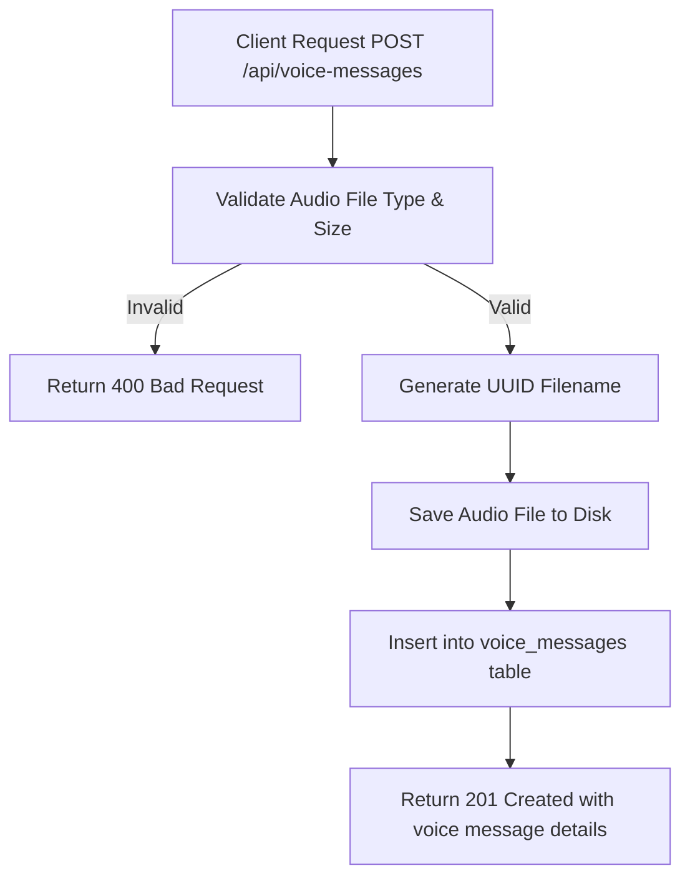

# Task: Upload Voice Message

**Endpoint**: `POST /api/voice-messages`

## 1. API Documentation

- **Method**: `POST`
- **URL**: `/api/voice-messages`
- **Access**: Private (Authenticated Users)
- **Content-Type**: `multipart/form-data`
- **Request Body**:
  ```
  audio: File (audio/webm, audio/mp3, audio/wav, max 5MB)
  questionId: string (optional)
  answerId: string (optional)
  duration: number (audio duration in seconds)
  ```
- **Response (201 Created)**:
  ```json
  {
    "success": true,
    "message": "Voice message uploaded successfully",
    "voiceMessage": {
      "id": "uuid",
      "fileName": "voice-message.webm",
      "fileType": "audio/webm",
      "fileSize": 512000,
      "duration": 30,
      "fileUrl": "/api/voice-messages/uuid",
      "uploadedBy": 1,
      "createdAt": "2026-06-20T10:00:00Z"
    }
  }
  ```

## 2. Instructions

1. Create `voice-message.validation.js` to validate audio file type and size.
2. Implement `voiceMessageController` in `voice-message.controller.js`.
3. In `voice-message.service.js`, write `uploadVoiceMessageService`:
   - Validate audio file type (webm, mp3, wav).
   - Validate file size (max 5MB).
   - Generate unique filename using UUID.
   - Save file to `/uploads/voice-messages/` directory.
   - Insert voice message metadata into `voice_messages` table.
   - Return voice message details.

## 3. Logic & Git Instructions

### Logic Steps

1. **Validate Input**: Check audio file meets type/size requirements.
2. **Generate UUID**: Create unique identifier for the file.
3. **Save File**: Write file to disk with UUID as filename.
4. **Database Insert**: Store voice message metadata in `voice_messages` table.
5. **Return Payload**: Send back voice message details with playback URL.

### Git Workflow

```bash
git checkout main
git pull origin main
git checkout -b feature/T-29-upload-voice
# Make your changes
git add .
git commit -m "[T-29] Implement voice message upload"
git push origin feature/T-29-upload-voice
```

### PR Checklist (include in every PR description)

```markdown
- [ ] Code compiles with no errors (`npm run dev` starts cleanly)
- [ ] Postman tests pass for all endpoints in this task
- [ ] Audio uploads correctly to /uploads/voice-messages/
- [ ] All acceptance criteria from the task are met
- [ ] Files match the exact paths listed in the task
```

## 4. Logic Diagram


