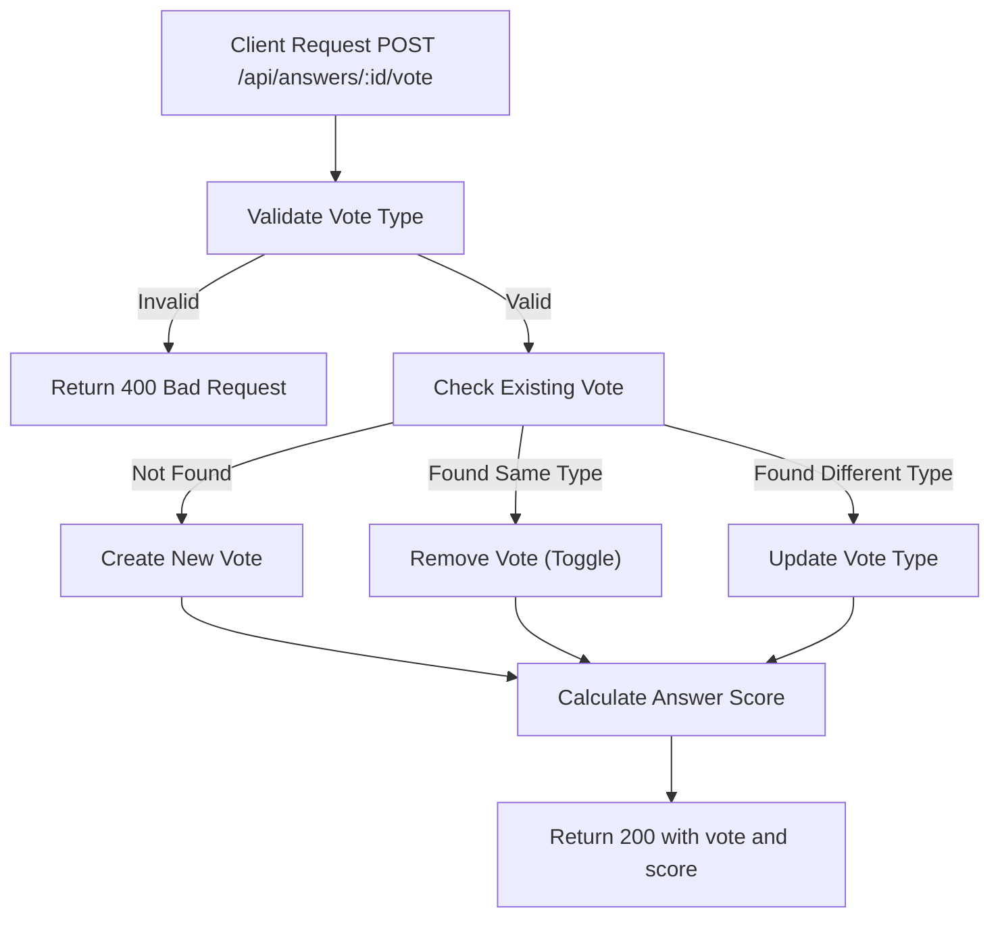

# Task: Upvote/Downvote Answer

**Endpoint**: `POST /api/answers/:answerId/vote`

## 1. API Documentation

- **Method**: `POST`
- **URL**: `/api/answers/:answerId/vote`
- **Access**: Private (Authenticated Users)
- **Content-Type**: `application/json`
- **Request Body**:
  ```json
  {
    "voteType": "upvote | downvote"
  }
  ```
- **Response (200 OK)**:
  ```json
  {
    "success": true,
    "message": "Vote recorded successfully",
    "vote": {
      "id": 1,
      "answerId": "uuid",
      "userId": 1,
      "voteType": "upvote",
      "createdAt": "2026-06-20T10:00:00Z"
    },
    "answerScore": 5
  }
  ```

## 2. Instructions

1. Create `vote.validation.js` to validate voteType.
2. Implement `voteController` in `vote.controller.js`.
3. In `vote.service.js`, write `createVoteService`:
   - Check if user already voted on this answer.
   - If exists and same type, remove vote (toggle).
   - If exists and different type, update vote type.
   - If not exists, create new vote.
   - Calculate answer score (upvotes - downvotes).
   - Return vote details and new score.

## 3. Logic & Git Instructions

### Logic Steps

1. **Validate Input**: Check voteType is "upvote" or "downvote".
2. **Check Existing**: Query `votes` table for user+answer combination.
3. **Toggle/Update/Create**: Handle vote logic based on existing vote.
4. **Calculate Score**: Sum all votes for the answer.
5. **Return Payload**: Send back vote details and new score.

### Git Workflow

```bash
git checkout main
git pull origin main
git checkout -b feature/T-31-vote-answer
# Make your changes
git add .
git commit -m "[T-31] Implement upvote/downvote for answers"
git push origin feature/T-31-vote-answer
```

### PR Checklist (include in every PR description)

```markdown
- [ ] Code compiles with no errors (`npm run dev` starts cleanly)
- [ ] Postman tests pass for all endpoints in this task
- [ ] Vote toggles correctly
- [ ] All acceptance criteria from the task are met
- [ ] Files match the exact paths listed in the task
```

## 4. Logic Diagram


