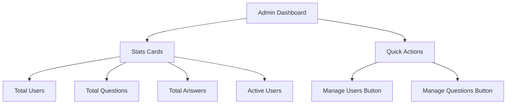

# Task: Admin Dashboard Page

## 1. Page Overview
Admin dashboard showing stats and management options.

- **Path**: `/frontend/src/pages/Admin/AdminDashboard.jsx`
- **Route**: `/admin`

## 2. Component Hierarchy


## 3. API Integrations
- `getStats()` -> `GET /api/admin/stats`

## 4. Detailed Logic
1. Fetch stats on mount
2. Display stat cards with numbers
3. Show quick action buttons
4. Only visible to admin users

## 5. Git Workflow
```bash
git checkout -b feature/T-37-admin-dashboard
```
