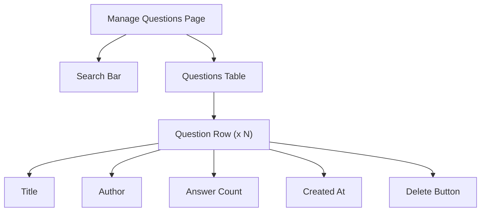

# Task: Admin Manage Questions Page

## 1. Page Overview
Admin page to view and manage all questions.

- **Path**: `/frontend/src/pages/Admin/ManageQuestions.jsx`
- **Route**: `/admin/questions`

## 2. Component Hierarchy


## 3. API Integrations
- `getQuestions(page, search)` -> `GET /api/questions`
- `deleteQuestion(hash)` -> `DELETE /api/admin/questions/:hash`

## 4. Detailed Logic
1. Fetch questions on mount
2. Search by title
3. Delete with confirmation dialog
4. Link to question detail

## 5. Git Workflow
```bash
git checkout -b feature/T-37-admin-questions
```
