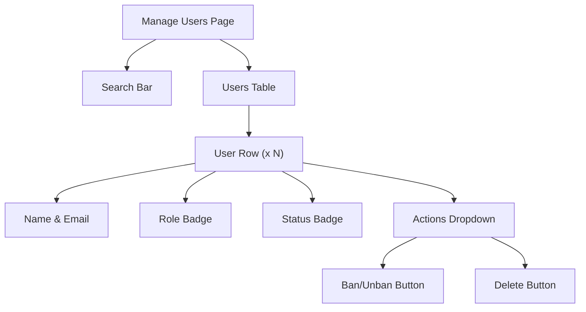

# Task: Admin Manage Users Page

## 1. Page Overview
Admin page to view and manage all users.

- **Path**: `/frontend/src/pages/Admin/ManageUsers.jsx`
- **Route**: `/admin/users`

## 2. Component Hierarchy


## 3. API Integrations
- `getUsers(page, search)` -> `GET /api/admin/users`
- `updateUserStatus(userId, status)` -> `PUT /api/admin/users/:userId/status`

## 4. Detailed Logic
1. Fetch users on mount and search
2. Search by name or email
3. Ban/unban user with confirmation
4. Show user stats (questions, answers)

## 5. Git Workflow
```bash
git checkout -b feature/T-37-admin-users
```
