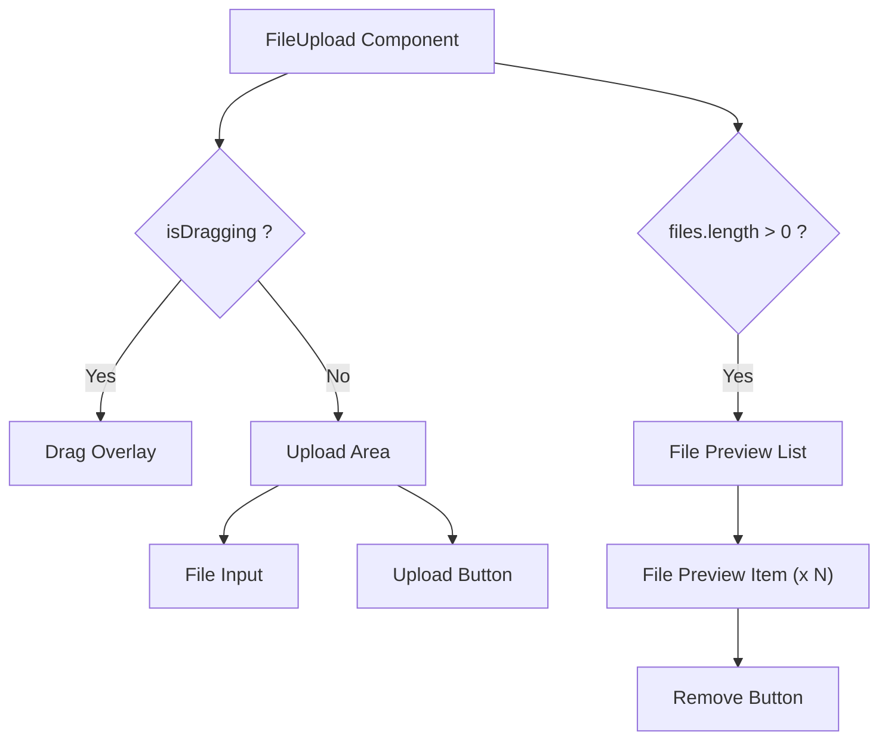

# Task: File Upload Component

## 1. Page Overview
Reusable file upload component with drag-and-drop support for images and documents.

- **Path**: `/frontend/src/components/common/FileUpload/FileUpload.jsx`
- **Usage**: Post Question page, Answer form

## 2. Component Hierarchy


## 3. API Integrations
Uses `attachment.service.js`:
- `uploadAttachment(file, questionId, answerId)` -> `POST /api/attachments`
- `deleteAttachment(attachmentId)` -> `DELETE /api/attachments/:attachmentId`

## 4. Detailed Logic
1. **State Management**:
   - `files` array for selected files.
   - `isDragging` boolean for drag state.
   - `uploadProgress` object for upload status.
   - `error` string for validation errors.

2. **Drag & Drop**:
   - Handle `dragEnter`, `dragLeave`, `dragOver`, `drop` events.
   - Highlight drop zone on drag.
   - Prevent default browser behavior.

3. **File Validation**:
   - Check file type (images: png, jpeg, gif; documents: pdf).
   - Check file size (max 10MB).
   - Show validation errors.

4. **Upload Flow**:
   - On file select or drop, validate file.
   - Add to files array with preview URL.
   - Show upload progress.
   - On submit, upload files and return attachment IDs.

5. **UI/UX**:
   - Show drag overlay when dragging.
   - Display file previews for images.
   - Show file icons for documents.
   - Allow removing files before upload.

## 5. Git Workflow & PR Checklist
```bash
git checkout main
git pull origin main
git checkout -b feature/FE-file-upload
# Make your changes
git add .
git commit -m "[FE] Implement file upload component"
git push origin feature/FE-file-upload
```

### PR Checklist (include in every PR description)
```markdown
- [ ] Code compiles with no errors (`npm run dev` starts cleanly)
- [ ] No console errors in the browser
- [ ] Drag and drop works correctly
- [ ] File validation works
- [ ] All acceptance criteria from the task are met
- [ ] Files match the exact paths listed in the task
```
