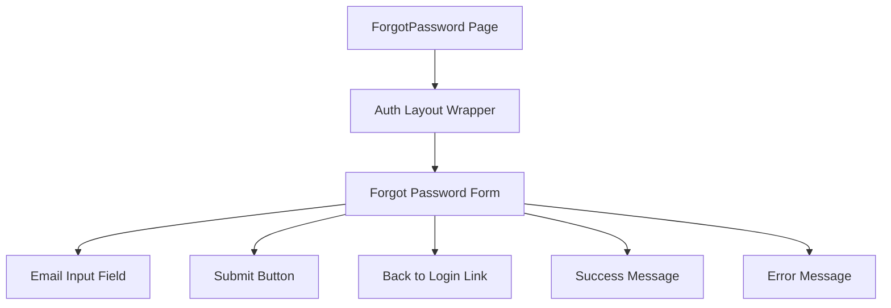

# Task: Forgot Password Page

## 1. Page Overview
Forgot Password page where users can enter their email to receive a password reset link.

- **Path**: `/frontend/src/pages/Auth/ForgotPassword.jsx`
- **Route**: `/auth/forgot-password`
- **Usage**: Auth page (linked from login form)

## 2. Component Hierarchy


## 3. API Integrations
Uses `auth.service.js`:
- `forgotPassword(email)` -> `POST /api/auth/forgot-password`

## 4. Detailed Logic
1. **State Management**:
   - `email` for email input.
   - `isLoading` for loading state.
   - `error` for error messages.
   - `success` for success messages.

2. **Form Validation**:
   - Validate email format before submission.
   - Show error if email is empty or invalid.

3. **Form Submission**:
   - Call `forgotPassword` API with email.
   - Show success message on success.
   - Show error message on failure.
   - Clear form after success.

5. **UI/UX**:
   - Consistent with existing Auth page styling.
   - Loading spinner on submit button.
   - Clear success message after submission.
   - Link back to login page.

## 5. Files to Create/Modify
- `frontend/src/pages/Auth/ForgotPassword.jsx` - New component
- `frontend/src/pages/Auth/Auth.jsx` - Add "Forgot Password?" link
- `frontend/src/services/auth.service.js` - Add `forgotPassword` function

## 6. Git Workflow & PR Checklist
```bash
git checkout main
git pull origin main
git checkout -b feature/FE-forgot-password
# Make your changes
git add .
git commit -m "[FE] Implement forgot password page"
git push origin feature/FE-forgot-password
```

### PR Checklist (include in every PR description)
```markdown
- [ ] Code compiles with no errors (`npm run dev` starts cleanly)
- [ ] No console errors in the browser
- [ ] Forgot password form works correctly
- [ ] Success message displays after submission
- [ ] Link back to login works
- [ ] All acceptance criteria from the task are met
- [ ] Files match the exact paths listed in the task
```
