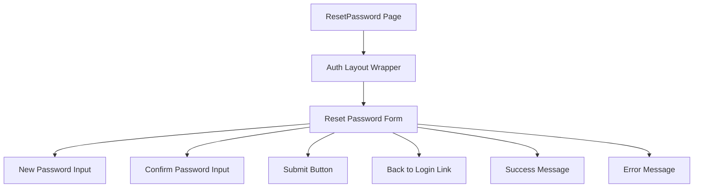

# Task: Reset Password Page

## 1. Page Overview
Reset Password page where users can set a new password using the token from their email.

- **Path**: `/frontend/src/pages/Auth/ResetPassword.jsx`
- **Route**: `/auth/reset-password`
- **Usage**: Auth page (accessed from email reset link)

## 2. Component Hierarchy


## 3. API Integrations
Uses `auth.service.js`:
- `resetPassword(token, password)` -> `POST /api/auth/reset-password`

## 4. Detailed Logic
1. **State Management**:
   - `password` for new password input.
   - `confirmPassword` for password confirmation.
   - `token` for reset token from URL query params.
   - `isLoading` for loading state.
   - `error` for error messages.
   - `success` for success messages.

2. **Token Extraction**:
   - Extract `token` from URL query params: `?token=xxx`.
   - Show error if token is missing.

3. **Form Validation**:
   - Validate password length (min 6 characters).
   - Validate password and confirm password match.
   - Show error if validation fails.

4. **Form Submission**:
   - Call `resetPassword` API with token and password.
   - Show success message on success.
   - Show error message on failure.
   - Redirect to login after success.

5. **UI/UX**:
   - Consistent with existing Auth page styling.
   - Password visibility toggle.
   - Loading spinner on submit button.
   - Clear success/error messages.
   - Auto-redirect to login after success.

## 5. Files to Create/Modify
- `frontend/src/pages/Auth/ResetPassword.jsx` - New component
- `frontend/src/services/auth.service.js` - Add `resetPassword` function
- `frontend/src/App.jsx` - Add route for `/auth/reset-password`

## 6. Git Workflow & PR Checklist
```bash
git checkout main
git pull origin main
git checkout -b feature/FE-reset-password
# Make your changes
git add .
git commit -m "[FE] Implement reset password page"
git push origin feature/FE-reset-password
```

### PR Checklist (include in every PR description)
```markdown
- [ ] Code compiles with no errors (`npm run dev` starts cleanly)
- [ ] No console errors in the browser
- [ ] Reset password form works correctly
- [ ] Token is extracted from URL correctly
- [ ] Password validation works
- [ ] Success message displays after submission
- [ ] Redirect to login works after success
- [ ] All acceptance criteria from the task are met
- [ ] Files match the exact paths listed in the task
```
