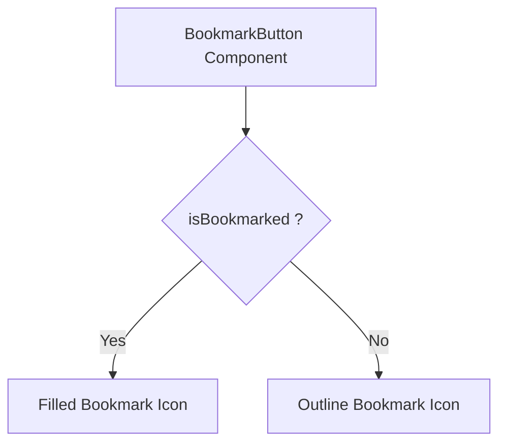

# Task: Bookmark Button Component

## 1. Page Overview
Bookmark button component for questions.

- **Path**: `/frontend/src/components/common/BookmarkButton/BookmarkButton.jsx`
- **Usage**: Question Card, Question Detail page

## 2. Component Hierarchy


## 3. API Integrations
Uses `bookmark.service.js`:
- `toggleBookmark(questionHash)` -> `POST /api/bookmarks`

## 4. Detailed Logic
1. **State Management**:
   - `isBookmarked` for current state.
   - `isLoading` for loading state.

2. **Toggle Flow**:
   - Optimistic update on click.
   - Call API to toggle bookmark.
   - Revert on error.

5. **UI/UX**:
   - Animated icon change.
   - Tooltip showing action.
   - Disabled state while loading.

## 5. Git Workflow & PR Checklist
```bash
git checkout main
git pull origin main
git checkout -b feature/FE-bookmark-button
# Make your changes
git add .
git commit -m "[FE] Implement bookmark button"
git push origin feature/FE-bookmark-button
```

### PR Checklist (include in every PR description)
```markdown
- [ ] Code compiles with no errors (`npm run dev` starts cleanly)
- [ ] No console errors in the browser
- [ ] Bookmark toggles correctly
- [ ] All acceptance criteria from the task are met
- [ ] Files match the exact paths listed in the task
```
