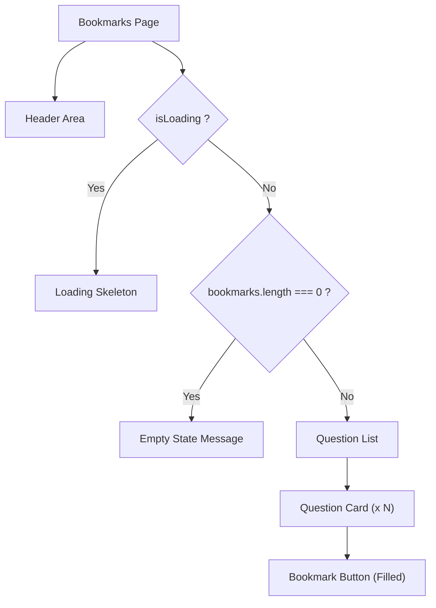

# Task: Bookmarks Page

## 1. Page Overview
Bookmarks page to display saved questions.

- **Path**: `/frontend/src/pages/Bookmarks/Bookmarks.jsx`
- **Route**: `/bookmarks`

## 2. Component Hierarchy


## 3. API Integrations
Uses `bookmark.service.js`:
- `getBookmarks(page, limit)` -> `GET /api/bookmarks`
- `removeBookmark(questionHash)` -> `DELETE /api/bookmarks/:questionHash`

## 4. Detailed Logic
1. **State Management**:
   - `bookmarks` array for saved questions.
   - `isLoading` for loading state.
   - `pagination` for page info.

2. **Data Fetching**:
   - Fetch bookmarks on mount.
   - Support pagination (load more).

3. **Actions**:
   - Remove bookmark (with confirmation).
   - Navigate to question on click.

5. **UI/UX**:
   - Show bookmark icon on each question.
   - Empty state with call-to-action.
   - Smooth remove animation.

## 5. Git Workflow & PR Checklist
```bash
git checkout main
git pull origin main
git checkout -b feature/FE-bookmarks-page
# Make your changes
git add .
git commit -m "[FE] Implement bookmarks page"
git push origin feature/FE-bookmarks-page
```

### PR Checklist (include in every PR description)
```markdown
- [ ] Code compiles with no errors (`npm run dev` starts cleanly)
- [ ] No console errors in the browser
- [ ] Bookmarks load correctly
- [ ] Remove bookmark works
- [ ] All acceptance criteria from the task are met
- [ ] Files match the exact paths listed in the task
```
