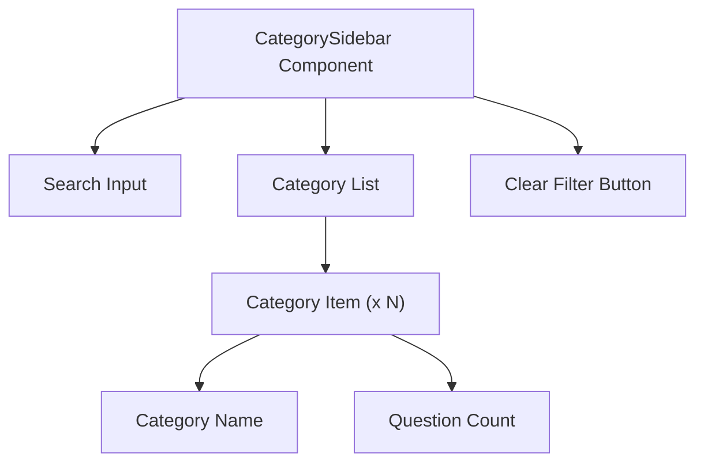

# Task: Category Sidebar

## 1. Page Overview
Category filter sidebar for the dashboard page.

- **Path**: `/frontend/src/components/Dashboard/CategorySidebar/CategorySidebar.jsx`
- **Usage**: Dashboard page

## 2. Component Hierarchy


## 3. API Integrations
Uses `category.service.js`:
- `getCategories()` -> `GET /api/categories`
- `getQuestionsByCategory(categoryId)` -> `GET /api/questions/category/:categoryId`

## 4. Detailed Logic
1. **State Management**:
   - `categories` array for all categories.
   - `selectedCategory` for active filter.
   - `isLoading` for loading state.
   - `searchQuery` for filtering categories.

2. **Category Selection**:
   - On category click, filter questions.
   - Highlight selected category.
   - Clear filter on same category click.
   - Update URL params for sharing.

3. **Search/Filter**:
   - Filter categories by name.
   - Show matching categories.
   - Clear search on category select.

5. **UI/UX**:
   - Sticky sidebar on desktop.
   - Collapsible on mobile.
   - Show question count per category.
   - Smooth selection animation.

## 5. Git Workflow & PR Checklist
```bash
git checkout main
git pull origin main
git checkout -b feature/FE-category-sidebar
# Make your changes
git add .
git commit -m "[FE] Implement category sidebar"
git push origin feature/FE-category-sidebar
```

### PR Checklist (include in every PR description)
```markdown
- [ ] Code compiles with no errors (`npm run dev` starts cleanly)
- [ ] No console errors in the browser
- [ ] Category selection filters questions
- [ ] Search within categories works
- [ ] All acceptance criteria from the task are met
- [ ] Files match the exact paths listed in the task
```
