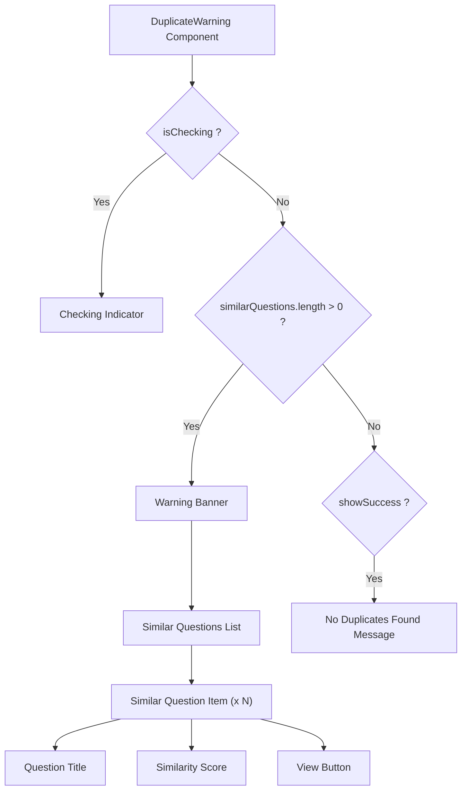

# Task: Duplicate Question Warning

## 1. Page Overview
Duplicate question detection UI that shows similar questions when posting.

- **Path**: `/frontend/src/components/PostQuestion/DuplicateWarning/DuplicateWarning.jsx`
- **Usage**: Post Question page

## 2. Component Hierarchy


## 3. API Integrations
Uses `duplicate.service.js`:
- `checkDuplicate(title, description)` -> `POST /api/questions/check-duplicate`

## 4. Detailed Logic
1. **State Management**:
   - `similarQuestions` array for similar questions.
   - `isChecking` for loading state.
   - `showWarning` for warning visibility.

2. **Debounced Check**:
   - Check for duplicates as user types.
   - Debounce API calls (500ms).
   - Only check when title has min 10 chars.

3. **Warning Display**:
   - Show warning banner when duplicates found.
   - List similar questions with similarity score.
   - Link to view similar question.
   - Option to proceed anyway.

5. **UI/UX**:
   - Non-blocking warning (user can still post).
   - Clear similarity percentage.
   - Quick link to similar questions.
   - Dismissable warning.

## 5. Git Workflow & PR Checklist
```bash
git checkout main
git pull origin main
git checkout -b feature/FE-duplicate-warning
# Make your changes
git add .
git commit -m "[FE] Implement duplicate question warning"
git push origin feature/FE-duplicate-warning
```

### PR Checklist (include in every PR description)
```markdown
- [ ] Code compiles with no errors (`npm run dev` starts cleanly)
- [ ] No console errors in the browser
- [ ] Duplicate detection works
- [ ] Warning displays correctly
- [ ] All acceptance criteria from the task are met
- [ ] Files match the exact paths listed in the task
```
