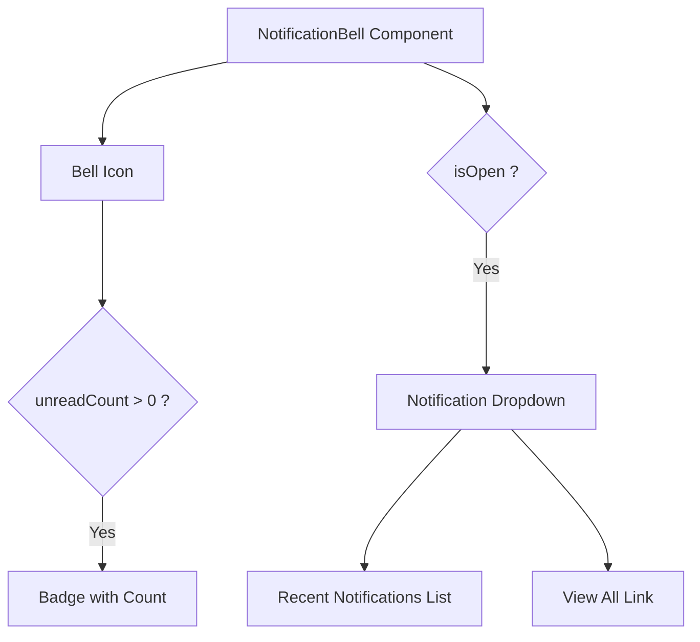

# Task: Notification Bell Component

## 1. Page Overview
Notification bell icon with unread count badge for the navbar.

- **Path**: `/frontend/src/components/common/NotificationBell/NotificationBell.jsx`
- **Usage**: Navbar

## 2. Component Hierarchy


## 3. API Integrations
Uses `notification.service.js`:
- `getNotifications(1, 5, true)` -> `GET /api/notifications?limit=5&unreadOnly=true`

## 4. Detailed Logic
1. **State Management**:
   - `unreadCount` for badge.
   - `recentNotifications` for dropdown.
   - `isOpen` for dropdown state.

2. **Polling**:
   - Poll for new notifications every 30 seconds.
   - Update unread count.
   - Update recent notifications list.

3. **Interactions**:
   - Click bell to toggle dropdown.
   - Click notification to navigate and mark as read.
   - Click "View All" to go to notifications page.
   - Close dropdown on outside click.

5. **UI/UX**:
   - Animated bell icon on new notification.
   - Badge with count (max 99+).
   - Smooth dropdown animation.
   - Show notification type icons.

## 5. Git Workflow & PR Checklist
```bash
git checkout main
git pull origin main
git checkout -b feature/FE-notification-bell
# Make your changes
git add .
git commit -m "[FE] Implement notification bell component"
git push origin feature/FE-notification-bell
```

### PR Checklist (include in every PR description)
```markdown
- [ ] Code compiles with no errors (`npm run dev` starts cleanly)
- [ ] No console errors in the browser
- [ ] Bell shows correct unread count
- [ ] Dropdown shows recent notifications
- [ ] All acceptance criteria from the task are met
- [ ] Files match the exact paths listed in the task
```
