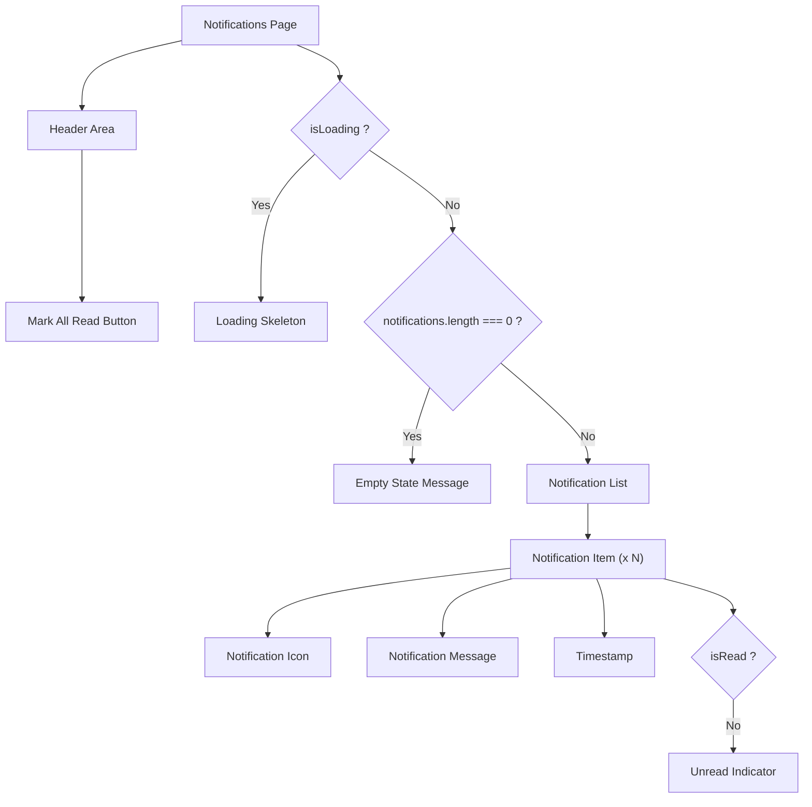

# Task: Notifications Page

## 1. Page Overview
Notifications page to display user notifications with read/unread status.

- **Path**: `/frontend/src/pages/Notifications/Notifications.jsx`
- **Route**: `/notifications`

## 2. Component Hierarchy


## 3. API Integrations
Uses `notification.service.js`:
- `getNotifications(page, limit, unreadOnly)` -> `GET /api/notifications`
- `markAsRead(notificationId)` -> `PUT /api/notifications/:notificationId/read`

## 4. Detailed Logic
1. **State Management**:
   - `notifications` array for notification data.
   - `unreadCount` for badge display.
   - `isLoading` for loading state.
   - `filter` for read/unread filter.

2. **Data Fetching**:
   - Fetch notifications on mount.
   - Support pagination (infinite scroll or load more).
   - Filter by read/unread status.

3. **Actions**:
   - Mark individual notification as read.
   - Mark all as read.
   - Navigate to referenced content on click.

5. **UI/UX**:
   - Different icons for different notification types.
   - Unread indicator (bold text or dot).
   - Relative timestamps ("2 hours ago").
   - Swipe to delete (optional).

## 5. Git Workflow & PR Checklist
```bash
git checkout main
git pull origin main
git checkout -b feature/FE-notifications-page
# Make your changes
git add .
git commit -m "[FE] Implement notifications page"
git push origin feature/FE-notifications-page
```

### PR Checklist (include in every PR description)
```markdown
- [ ] Code compiles with no errors (`npm run dev` starts cleanly)
- [ ] No console errors in the browser
- [ ] Notifications load correctly
- [ ] Mark as read works
- [ ] All acceptance criteria from the task are met
- [ ] Files match the exact paths listed in the task
```
