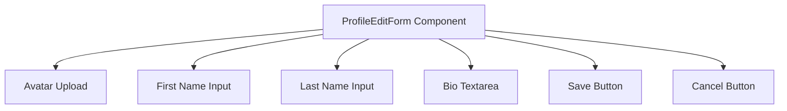

# Task: Profile Edit Form

## 1. Page Overview
Profile edit form for updating user info.

- **Path**: `/frontend/src/components/Profile/ProfileEditForm/ProfileEditForm.jsx`
- **Usage**: Profile page (modal or inline)

## 2. Component Hierarchy


## 3. API Integrations
Uses `profile.service.js`:
- `updateProfile(data)` -> `PUT /api/profile`
- `uploadAvatar(file)` -> `POST /api/profile/avatar`

## 4. Detailed Logic
1. **State Management**:
   - Form fields state.
   - `avatarPreview` for new avatar.
   - `isSaving` for save state.
   - `errors` for validation errors.

2. **Form Handling**:
   - Initialize with current profile data.
   - Validate on submit.
   - Upload avatar if changed.
   - Update profile.
   - Close form on success.

5. **UI/UX**:
   - Show current avatar with change option.
   - Preview new avatar before save.
   - Loading state while saving.
   - Success/error feedback.

## 5. Git Workflow & PR Checklist
```bash
git checkout main
git pull origin main
git checkout -b feature/FE-profile-edit
# Make your changes
git add .
git commit -m "[FE] Implement profile edit form"
git push origin feature/FE-profile-edit
```

### PR Checklist (include in every PR description)
```markdown
- [ ] Code compiles with no errors (`npm run dev` starts cleanly)
- [ ] No console errors in the browser
- [ ] Form loads with current data
- [ ] Save works correctly
- [ ] All acceptance criteria from the task are met
- [ ] Files match the exact paths listed in the task
```
