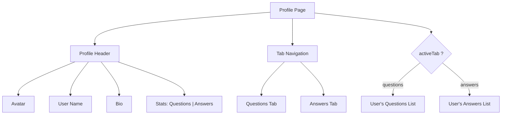

# Task: User Profile Page

## 1. Page Overview
User profile page showing user info and their questions/answers.

- **Path**: `/frontend/src/pages/Profile/Profile.jsx`
- **Route**: `/profile/:userId`

## 2. Component Hierarchy


## 3. API Integrations
Uses `profile.service.js`:
- `getProfile(userId)` -> `GET /api/profile/:userId`
- `getUserQuestions(userId)` -> `GET /api/questions?userId=:userId`
- `getUserAnswers(userId)` -> `GET /api/answers?userId=:userId`

## 4. Detailed Logic
1. **State Management**:
   - `profile` for user data.
   - `questions` for user's questions.
   - `answers` for user's answers.
   - `activeTab` for tab selection.
   - `isLoading` for loading state.

2. **Data Fetching**:
   - Fetch profile on mount.
   - Fetch questions/answers on tab change.

3. **Owner View**:
   - Show edit button if viewing own profile.
   - Allow avatar upload.

5. **UI/UX**:
   - Responsive header with avatar.
   - Stats display.
   - Tabbed content.

## 5. Git Workflow & PR Checklist
```bash
git checkout main
git pull origin main
git checkout -b feature/FE-profile-page
# Make your changes
git add .
git commit -m "[FE] Implement user profile page"
git push origin feature/FE-profile-page
```

### PR Checklist (include in every PR description)
```markdown
- [ ] Code compiles with no errors (`npm run dev` starts cleanly)
- [ ] No console errors in the browser
- [ ] Profile loads correctly
- [ ] Tabs switch correctly
- [ ] All acceptance criteria from the task are met
- [ ] Files match the exact paths listed in the task
```
