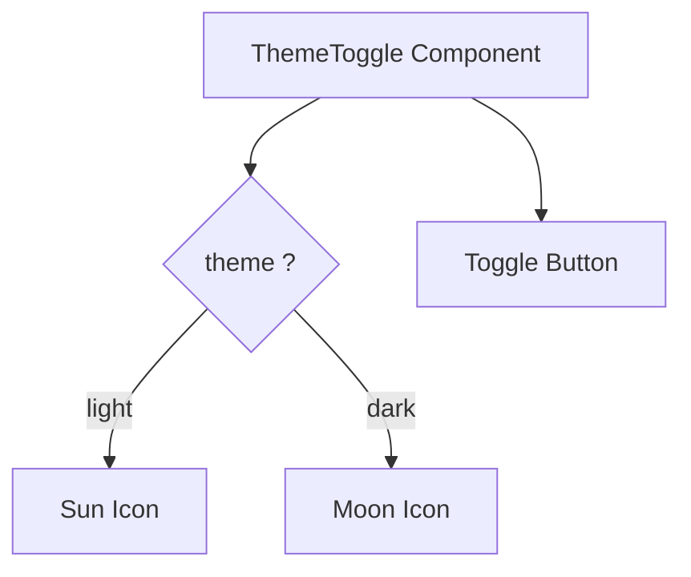

# Task: Dark Mode Toggle

## 1. Page Overview
Theme toggle component and dark mode support for the application.

- **Path**: `/frontend/src/components/common/ThemeToggle/ThemeToggle.jsx`
- **Usage**: Navbar, Settings page

## 2. Component Hierarchy


## 3. State Management
Uses React Context:
- `ThemeContext` for global theme state
- `localStorage` for persisting preference

## 4. Detailed Logic

1. **Theme Context**:
   ```javascript
   // ThemeContext.jsx
   - theme: 'light' | 'dark'
   - toggleTheme: () => void
   ```

2. **CSS Variables**:
   - Define light/dark colors in CSS variables
   - Toggle `data-theme` attribute on `<html>`

3. **Persistence**:
   - Save preference to `localStorage`
   - Load on app init
   - Respect system preference as default

4. **Implementation**:
   - Add CSS variables for colors
   - Create ThemeProvider wrapper
   - Add toggle component
   - Update all components to use CSS variables

5. **UI/UX**:
   - Smooth transition between themes
   - Animated icon swap
   - System preference detection

## 5. Git Workflow & PR Checklist
```bash
git checkout main
git pull origin main
git checkout -b feature/FE-dark-mode
# Make your changes
git add .
git commit -m "[FE] Implement dark mode toggle"
git push origin feature/FE-dark-mode
```

### PR Checklist (include in every PR description)
```markdown
- [ ] Code compiles with no errors (`npm run dev` starts cleanly)
- [ ] No console errors in the browser
- [ ] Theme toggles correctly
- [ ] Preference persists on reload
- [ ] All acceptance criteria from the task are met
- [ ] Files match the exact paths listed in the task
```
