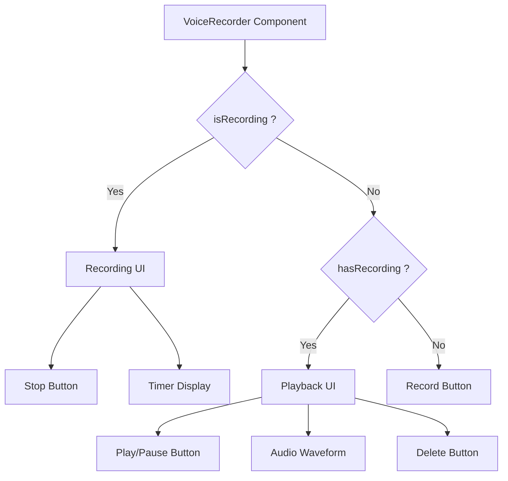

# Task: Voice Recorder Component

## 1. Page Overview
Audio recording component with playback controls for voice messages.

- **Path**: `/frontend/src/components/common/VoiceRecorder/VoiceRecorder.jsx`
- **Usage**: Post Question page, Answer form

## 2. Component Hierarchy


## 3. API Integrations
Uses `voice.service.js`:
- `uploadVoiceMessage(audioFile, questionId, answerId)` -> `POST /api/voice-messages`

## 4. Detailed Logic
1. **State Management**:
   - `isRecording` boolean.
   - `hasRecording` boolean.
   - `audioBlob` for recorded audio.
   - `audioUrl` for playback.
   - `duration` for recording time.
   - `mediaRecorder` for recording API.

2. **Recording Flow**:
   - Request microphone permission.
   - Start recording with MediaRecorder API.
   - Track duration with interval.
   - On stop, create audio blob and URL.

3. **Playback Flow**:
   - Use HTML5 Audio API.
   - Play/pause toggle.
   - Show waveform visualization (optional).
   - Allow re-record or delete.

4. **Upload Flow**:
   - Convert blob to File object.
   - Upload via voice service.
   - Return voice message ID.

5. **UI/UX**:
   - Animated recording indicator.
   - Timer showing duration.
   - Waveform visualization.
   - Clear controls for record/stop/play/delete.

## 5. Git Workflow & PR Checklist
```bash
git checkout main
git pull origin main
git checkout -b feature/FE-voice-recorder
# Make your changes
git add .
git commit -m "[FE] Implement voice recorder component"
git push origin feature/FE-voice-recorder
```

### PR Checklist (include in every PR description)
```markdown
- [ ] Code compiles with no errors (`npm run dev` starts cleanly)
- [ ] No console errors in the browser
- [ ] Recording works correctly
- [ ] Playback works correctly
- [ ] All acceptance criteria from the task are met
- [ ] Files match the exact paths listed in the task
```
