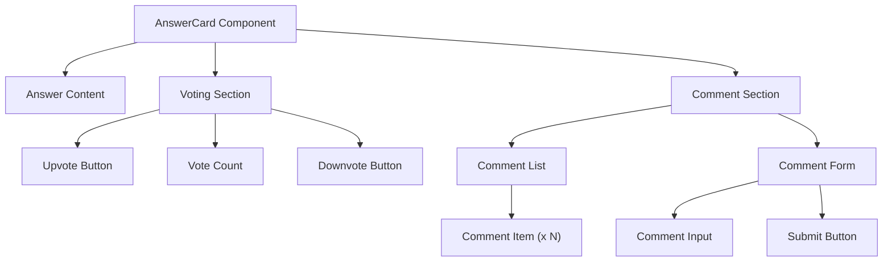

# Task: Voting & Comment UI

## 1. Page Overview
Upvote/downvote buttons and comment section for answers.

- **Path**: `/frontend/src/components/Answer/AnswerCard/AnswerCard.jsx`
- **Usage**: Question Detail page

## 2. Component Hierarchy


## 3. API Integrations
Uses `vote.service.js` and `comment.service.js`:
- `voteAnswer(answerId, voteType)` -> `POST /api/answers/:answerId/vote`
- `getComments(answerId)` -> `GET /api/answers/:answerId/comments`
- `addComment(answerId, content)` -> `POST /api/answers/:answerId/comments`

## 4. Detailed Logic
1. **State Management**:
   - `voteCount` for current score.
   - `userVote` for current user's vote (upvote/downvote/null).
   - `comments` array for comments.
   - `commentText` for new comment input.
   - `isLoading` for loading states.

2. **Voting Logic**:
   - Optimistic updates for vote count.
   - Toggle vote on same button click.
   - Switch vote on different button click.
   - Disable buttons while loading.

3. **Comment Logic**:
   - Fetch comments on component mount.
   - Add comment with optimistic update.
   - Show loading state while submitting.
   - Clear input on success.

5. **UI/UX**:
   - Highlight active vote button.
   - Animate vote count change.
   - Show comment count.
   - Infinite scroll for comments (optional).

## 5. Git Workflow & PR Checklist
```bash
git checkout main
git pull origin main
git checkout -b feature/FE-voting-comment
# Make your changes
git add .
git commit -m "[FE] Implement voting and comment UI"
git push origin feature/FE-voting-comment
```

### PR Checklist (include in every PR description)
```markdown
- [ ] Code compiles with no errors (`npm run dev` starts cleanly)
- [ ] No console errors in the browser
- [ ] Voting works correctly
- [ ] Comments load and submit correctly
- [ ] All acceptance criteria from the task are met
- [ ] Files match the exact paths listed in the task
```
